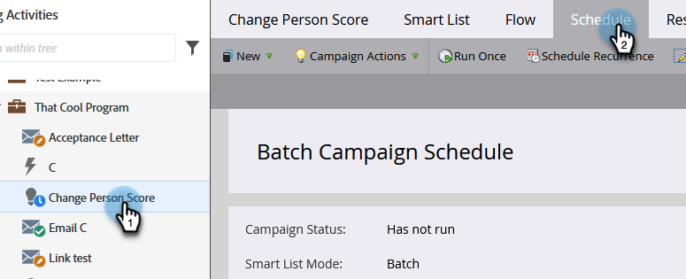

# Een geplande batchcampagne annuleren {#cancel-a-scheduled-batch-campaign-run}

Als u een run voor een van uw batchcampagnes hebt gepland en deze wilt annuleren, is het volgende.

1. Selecteer de campagne en ga naar het tabblad **[!UICONTROL Schedule]** .

   

1. Vind de geplande looppas u wilt annuleren en **x** naast het klikken.

   

1. Bevestig de annulering door op **[!UICONTROL OK]** te klikken.

   

>[!NOTE]
>
>Dit helpt niet als de run al is gestart. Gebruik deze optie als u besluit dat een toekomstige uitvoering moet worden geannuleerd.
