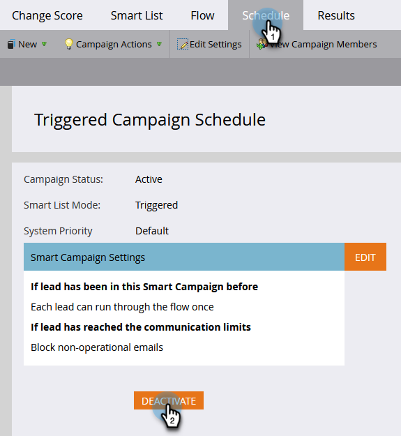

# Een slimme campagne activeren uitschakelen | Tabblad Planning {#deactivate-a-trigger-smart-campaign-schedule-tab}

Voer de volgende stappen uit als u een oude triggercampagne hebt die u moet deactiveren:

1. Zoek en selecteer uw actieve triggercampagne.

   

1. Klik op het tabblad Planning op **Deactiveren**.

   

1. Bevestigen door te klikken **Deactiveren**.

   

>[!NOTE]
>
>Hiermee wordt een einde gemaakt *new* mensen de stroom niet betreden, maar mensen in wachtende stappen of een andere stroomstap zullen zich door de stroom blijven bewegen tot gereed is.
