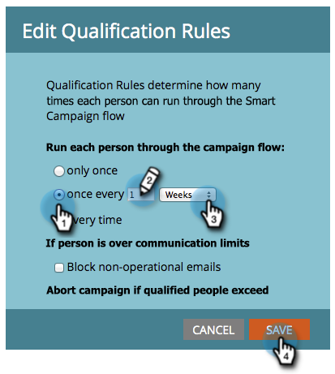

# Kwalificatieregels bewerken in een slimme campagne {#edit-qualification-rules-in-a-smart-campaign}

De regels van de erkenning bepalen hoe vaak iemand door de stroom in een slimme campagne kan lopen. Zelfs als iemand een slimme campagne meerdere keren activeert, worden deze standaard slechts eenmaal door de flow verzonden. Hieronder wordt beschreven hoe u deze instellingen wijzigt.

>[!NOTE]
>
>**FYI**
>
>Marketo is nu bezig met het standaardiseren van de taal voor alle abonnementen, dus u ziet mogelijk leads/leads in uw abonnement en personen/personen in docs.marketo.com. Deze termen betekenen hetzelfde. het heeft geen invloed op de instructies van het artikel . Er zijn nog enkele andere veranderingen. [Meer](http://docs.marketo.com/display/DOCS/Updates+to+Marketo+Terminology)informatie.

1. Klik in uw slimme campagne op het tabblad **Schema** en **Bewerk instellingen**.

   

   >[!TIP]
   >
   >U kunt ook op **Bewerken** rechts van Instellingen voor slimme campagne klikken.

1. Kies hoe vaak u uw mensen door de slimme campagnestroom wilt leiden: **slechts eenmaal**, **elke keer**, of **eenmaal per # dagen**/**weken**/**maanden**.

   

   >[!NOTE]
   >
   >Wanneer u een regel voor eens elke dag plaatst, zet Marketo dat in uren om. Als je bijvoorbeeld de regel één keer per dag instelt en een persoon op een zondagnacht om 10.00 uur in aanmerking komt, kan hij niet opnieuw in aanmerking komen tot maandag 10.00 uur. Deze logica is ook van toepassing bij het gebruik van weken of maanden. Een maand wordt altijd geteld als 30 dagen.

   >[!NOTE]
   >
   >**Herinnering**
   >
   >
   >Communicatielimieten worden standaard niet toegepast op slimme campagnes. Leer hoe u communicatielimieten kunt [toepassen op een slimme campagne](apply-communication-limits-to-smart-campaign.md).

   >[!NOTE]
   >
   >**Verwante artikelen**
   >
   >    
   >    
   >    * [Communicatielimieten toepassen op slimme campagnes](apply-communication-limits-to-smart-campaign.md)

Opdracht voltooid! U weet nu hoe u kwalificatieregels kunt beheren in een slimme campagne.