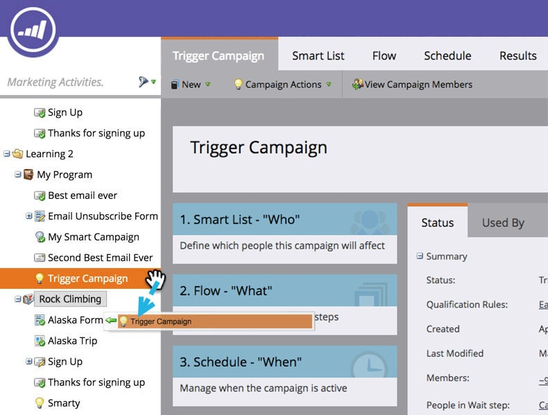

# Een slimme campagne verplaatsen {#move-a-smart-campaign}

Verplaats een slimme campagne tussen verschillende programma&#39;s of omslagen door belemmering-en-daling of de bewegingseigenschap in de boom te gebruiken.

## Slepen en neerzetten gebruiken {#use-drag-and-drop}

1. Ga naar **Marketingactiviteiten**.

   

1. Selecteer de slimme campagne en sleep deze naar een nieuw programma.

   

   Geweldig! Die slimme campagne staat nu in een nieuw programma. Dit werkt ook met mappen.

   >[!NOTE]
   >
   >De regels van uw slimme campagne zullen niet veranderen - het zal enkel op een verschillende plaats worden genesteld.

## De functie Verplaatsen {#use-the-move-feature} gebruiken

U kunt slimme campagnes ook verplaatsen met de functie Verplaatsen in de boomstructuur.

1. Klik met de rechtermuisknop op de slimme campagne. Selecteer **Verplaatsen**.

   

1. Kies tussen het bewegen naar **Programma** of **Omslag**.

   

1. Selecteer de specifieke plaats voor de slimme campagne om zich te bewegen.

   

1. Klik **Verplaatsen**.

   

   Hoogste vijf! Deze slimme campagne is verplaatst.

   

