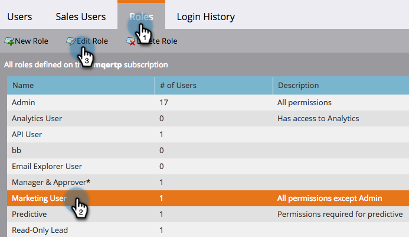

# Prioriteit overschrijven voor triggercampagnes {#priority-override-for-trigger-campaigns}

Beheerders kunnen de door Marketo Engage bepaalde prioriteit voor triggercampagnes overschrijven om prioriteiten in te stellen die beter aansluiten op bedrijfsdoelstellingen.

>[!NOTE]
>
>Deze eigenschap is slechts beschikbaar voor de Campagnes van de Trekker en aan gebruikers die [ &quot;de Prioriteit van de Campagne van de Trekker&quot;toestemming ](#grant-priority-override-access) hebben verleend uitgeven.

>[!CAUTION]
>
>Het wordt sterk geadviseerd dat u deze eigenschap op een beperkte reeks zaken kritieke campagnes (25 is het geadviseerde maximum) gebruikt. Het losjes gebruiken van de eigenschap op een grote reeks kan algemene campagneuitvoering negatief beïnvloeden.

## Toegang bij voorrang overschrijven van subsidie {#grant-priority-override-access}

>[!NOTE]
>
>Alleen beheerders of gebruikers met beheerdersverantwoordelijkheden hebben voorrang op de toegang tot de campagne.

1. Klik in het gebied **[!UICONTROL Admin]** op **[!UICONTROL Users & Roles]** .

   

1. Klik op de tab **[!UICONTROL Roles]** , selecteer de gebruiker aan wie u toegang wilt verlenen en klik vervolgens op **[!UICONTROL Edit Role]** .

   

1. Selecteer onder **[!UICONTROL Access Marketing Activities]** de optie **[!UICONTROL Edit Trigger Campaign Priority]**. Klik op **[!UICONTROL Save]**.

   

## Prioriteit overschrijven {#override-priority}

1. Zoek de triggercampagne. Klik er met de rechtermuisknop op en selecteer **[!UICONTROL Override Campaign Priority]** .

   

1. Klik op de schuifregelaar **[!UICONTROL Override Campaign Priority]** om deze in te schakelen. Kies een nieuw prioriteitsniveau en klik op **[!UICONTROL Confirm]** .

   

   Het nieuwe prioriteitsniveau wordt weergegeven op het tabblad **[!UICONTROL Schedule]** .

   

>[!NOTE]
>
>* U kunt de standaardprioriteit van uw campagne bekijken in [!UICONTROL Campaign Queue] onder [!UICONTROL Marketing Activities]. Om het uitvoeringspercentage te verhogen, raden we u aan uw campagneprioriteit op één niveau hoger in te stellen dan het standaardniveau.
>* De door de gebruiker ingestelde prioriteit geldt alleen voor nieuwe personen die in aanmerking komen voor de campagne. Dit heeft geen invloed op personen die al in de wachtrij staan.
>* Prioritaire met voeten treedt worden gevangen in [ Spoor van de Controle ](/help/marketo/product-docs/administration/audit-trail/audit-trail-overview.md){target="_blank"}.
