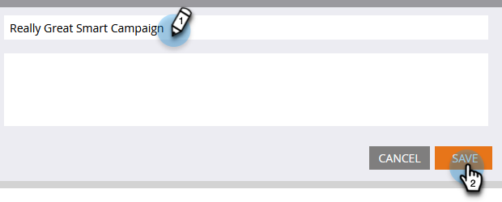

# De naam van een slimme campagne wijzigen {#rename-a-smart-campaign}

U kunt de naam van een bestaande slimme campagne wijzigen. Zo gaat het.

1. Ga naar **[!UICONTROL Marketing Activities]** .

   

1. Selecteer de slimme campagne en klik op de naam ervan aan de rechterkant.

   

   >[!TIP]
   >
   >De slimme namen van de Campagne binnen programma&#39;s vertalen altijd aan het formaat &quot;ProgramName.CampaignName&quot;.

1. Voer de nieuwe naam voor de slimme campagne in en klik op **[!UICONTROL Save]** .

   

   >[!NOTE]
   >
   >De oude naam is zichtbaar in het tabblad en verandert bij het opslaan.

Snel en eenvoudig! Overal waar naar de slimme campagne wordt verwezen, wordt deze ook gewijzigd.
