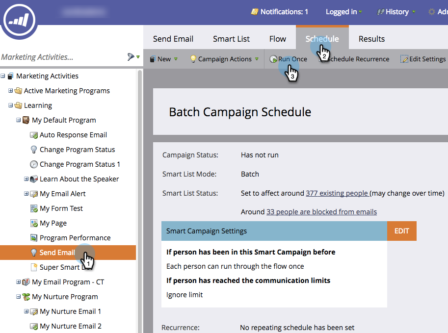

# Een slimme campagne voor batchverwerking plannen om later {#schedule-a-batch-smart-campaign-to-run-later} uit te voeren

Als je een &#39;batch smart&#39; campagne wilt instellen om op een bepaald moment in de toekomst te starten, is dit hoe.

>[!TIP]
>
>U kunt een batch smart campagne in de mening van het programmaprogramma [ook opnieuw plannen.](/help/marketo/product-docs/core-marketo-concepts/programs/program-schedule-view/reschedule-a-batch-smart-campaign-in-the-program-schedule-view.md)

1. Selecteer de batch smart campagne u wilt in werking stellen, naar **Schema** tabel gaan, en **Looppas Eenmaal** klikken.

   

1. Klik **Later uitvoeren**, dan klik het kalenderpictogram en selecteer de dag u de slimme campagne wilt lopen.

   

1. Selecteer de tijd waarop de slimme campagne moet worden uitgevoerd (minimaal 15 minuten voor).

   

1. Klik **Opslaan**.

   

1. U kunt de geplande looppas bevestigen door **Schedule** tabel te bekijken.

   

   >[!NOTE]
   >
   >[Een terugkerende batchcampagne plannen](/help/marketo/product-docs/core-marketo-concepts/smart-campaigns/using-smart-campaigns/schedule-a-recurring-batch-campaign.md)
