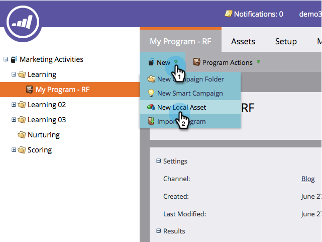

# Een slimme lijst maken {#create-a-smart-list}

Met slimme lijsten kunt u specifieke groepen mensen zoeken aan de hand van eenvoudige filters. Zo maak je er een.

1. Ga naar **[!UICONTROL Marketing Activities]**.

   

1. Selecteer het programma waarin u de slimme lijst wilt maken.

   

1. Onder **[!UICONTROL New]**, klikt u op **[!UICONTROL New Local Asset]**.

   

1. Selecteren **[!UICONTROL Smart List]**.

   

1. Voer een **[!UICONTROL Name]** en klik op **[!UICONTROL Create]**.

   

   Ta-da, geweldig werk! Laten we nu enkele filters toevoegen en definiëren.

   >[!MORELIKETHIS]
   >
   >[Filters zoeken en toevoegen aan een slimme lijst](/help/marketo/product-docs/core-marketo-concepts/smart-lists-and-static-lists/creating-a-smart-list/find-and-add-filters-to-a-smart-list.md){target="_blank"}
