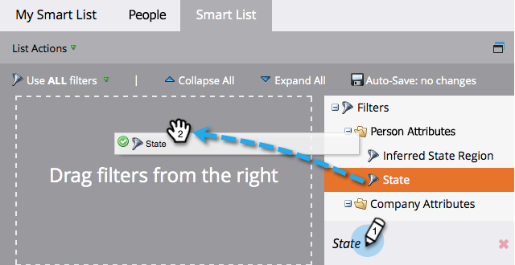

# Filters zoeken en toevoegen aan een slimme lijst {#find-and-add-filters-to-a-smart-list}

Zodra u [&#x200B; een Slimme Lijst &#x200B;](/help/marketo/product-docs/core-marketo-concepts/smart-lists-and-static-lists/creating-a-smart-list/create-a-smart-list.md){target="_blank"} hebt gecreeerd, moet u toevoegen en [&#x200B; &#x200B;](/help/marketo/product-docs/core-marketo-concepts/smart-lists-and-static-lists/creating-a-smart-list/define-smart-list-filters.md){target="_blank"} filters bepalen. Hieronder wordt beschreven hoe u filters kunt zoeken en toevoegen.

In dit voorbeeld zoeken we alle mensen in Californië met een score van meer dan 50.

>[!TIP]
>
>Bekijk de structuur aan de rechterkant - filters zijn zeer krachtig en hebben een grote verscheidenheid aan mogelijke functies.

1. Ga naar **[!UICONTROL Marketing Activities]** .

   

1. Selecteer de slimme lijst waaraan u filters wilt toevoegen en klik op de tab **[!UICONTROL Smart List]** .

   

1. Zoek en sleep het filter **[!UICONTROL State]** naar het canvas.

   

1. Zoek en sleep het filter **[!UICONTROL Score]** eroverheen.

   

Perfect! Laten we deze filters definiëren.

>[!MORELIKETHIS]
>
>* [&#x200B; creeer een Slimme Lijst &#x200B;](/help/marketo/product-docs/core-marketo-concepts/smart-lists-and-static-lists/creating-a-smart-list/create-a-smart-list.md){target="_blank"}
>* [&#x200B; bepaalt Slimme Filters van de Lijst &#x200B;](/help/marketo/product-docs/core-marketo-concepts/smart-lists-and-static-lists/creating-a-smart-list/define-smart-list-filters.md){target="_blank"}
