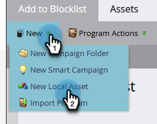
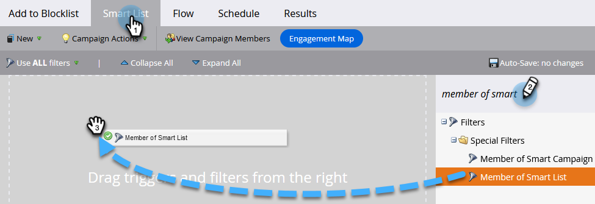
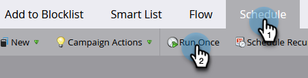

# Persoon toevoegen aan Lijst van gewezen personen {#add-person-to-blocklist}

Als u mensen aan uw Lijst van gewezen personen toevoegt, kunnen ze uw correspondentie niet ontvangen.

1. Een nieuwe [standaardprogramma](/help/marketo/product-docs/core-marketo-concepts/programs/creating-programs/create-a-program.md){target="_blank"} en noem het &quot;Toevoegen aan Lijst van gewezen personen.&quot;

1. Klik op **[!UICONTROL New]** en selecteer **[!UICONTROL New Local Asset]**.

   

1. Selecteren **[!UICONTROL Smart List]**.

   

1. Geef uw lijst een naam en klik op **[!UICONTROL Create]**.

   

1. Voeg alle mensen aan uw Slimme Lijst toe u aan uw Lijst van gewezen personen wilt toevoegen.

   

   >[!NOTE]
   >
   >Personen op je Lijst van gewezen personen ontvangen geen e-mails met een normale werking.

1. Ga terug naar uw programma.

   

1. Klik op **[!UICONTROL New]** en selecteer **[!UICONTROL New Smart Campaign]**.

   

1. Geef de nieuwe slimme campagne een naam. Klik op **[!UICONTROL Create]**.

   

1. Slepen en slepen **[!UICONTROL Member of Smart List]**.

   

1. Selecteer de slimme lijst die u net hebt gemaakt.

   

1. Klik op de knop **[!UICONTROL Flow]** tab. Sleep de **[!UICONTROL Change Data Value]** Flow-actie.

   

1. In de **[!UICONTROL Attribute]** vervolgkeuzelijst **[!UICONTROL Block Listed]** en instellen **[!UICONTROL New Value]** tot **[!UICONTROL true]**.

   

1. Klik op de knop **[!UICONTROL Schedule]** en selecteert u **[!UICONTROL Run Once]**.

   

1. Selecteren **[!UICONTROL Run Now]** en klik op **[!UICONTROL Run]**.

   

1. Klikken **[!UICONTROL Run]** opnieuw.

   

Deze mensen zullen geen e-mails meer ontvangen.

>[!TIP]
>
>Een [Trigger-campagne](/help/marketo/product-docs/core-marketo-concepts/smart-campaigns/creating-a-smart-campaign/create-a-new-smart-campaign.md){target="_blank"} gebruiken **Gegevenswaarde wijzigen** with **Blok aangeboden is waar** voor alle mensen in de toekomst die kenmerken hebben die geschikt zijn voor lijst van gewezen personen.
