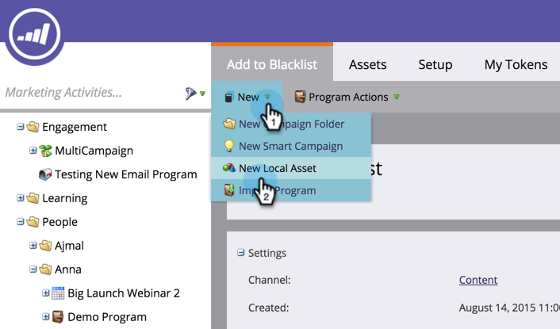

# Persoon toevoegen aan Lijst van gewezen personen {#add-person-to-blocklist}

Als u mensen aan uw Lijst van gewezen personen toevoegt, kunnen ze uw correspondentie niet ontvangen.

>[!NOTE]
>
>Marketo is bezig met het wijzigen van termen als Blacklist en Whitelist in de Lijst van gewezen personen en de Lijst van gewenste personen in ons product. Tijdens deze update ziet u mogelijk de oude termen in onze gebruikersinterface en documentatiescherm en de nieuwe termen in onze documentatietekst. Onze excuses voor de verwarring.

1. [Creeer een nieuw standaardprogramma ](/help/marketo/product-docs/core-marketo-concepts/programs/creating-programs/create-a-program.md) en noem het  **Toevoegen aan Lijst van gewezen personen**.

1. Klik **Nieuw** en selecteer **Nieuw Lokaal element**.

   

1. Geef uw lijst een naam en klik op **Maken**.

   

1. Voeg alle mensen aan uw **Slimme Lijst** toe u aan uw Lijst van gewezen personen wilt toevoegen.

   >[!NOTE]
   >
   >Personen op je Lijst van gewezen personen ontvangen geen e-mails met een normale werking.

   

1. Klik **Nieuw** en selecteer **Nieuwe slimme campagne**.

   

1. Geef de **Nieuwe slimme campagne** een naam. Klik **Maken**.

   

1. Sleep **Lid van Slimme Lijst**.

   

1. Selecteer de slimme lijst die u net hebt gemaakt.

   

1. Sleep **Gegevenswaarde wijzigen**.

   

1. Voor **Stroom**, ga **Blok op Lijst** voor **Kenmerk** in en reeks **Nieuwe Waarde** aan **true**.

   

1. Selecteer **Eenmaal uitvoeren** op het tabblad **Schema**.

   

1. Selecteer **Nu uitvoeren** en klik **Run**.

   

   JA! Deze mensen zullen geen e-mails meer ontvangen.

   >[!TIP]
   >
   >Maak een [trigger smart campagne](/help/marketo/product-docs/core-marketo-concepts/smart-campaigns/creating-a-smart-campaign/create-a-new-smart-campaign.md) met **Gegevenswaarde wijzigen** met **Blok in de lijst is true** voor alle mensen in de toekomst die kenmerken hebben die geschikt zijn voor lijst van gewezen personen.
