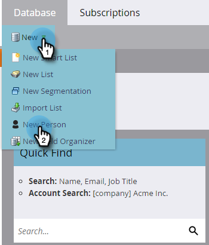

# Handmatig een persoon maken {#create-a-person-manually}

Er zijn veel manieren om een persoon naar Marketo Engage te krijgen. Als je er handmatig een moet maken, is dit hoe je het moet doen.

>[!CAUTION]
>
>Marketo ondersteunt geen e-mailadressen die emojis bevatten.

1. Ga naar de **[!UICONTROL Database]** .

   

1. Klik onder **[!UICONTROL New]** op **[!UICONTROL New Person]** .

   

1. Voer de gegevens van de persoon in en klik op **[!UICONTROL Create]** .

   
