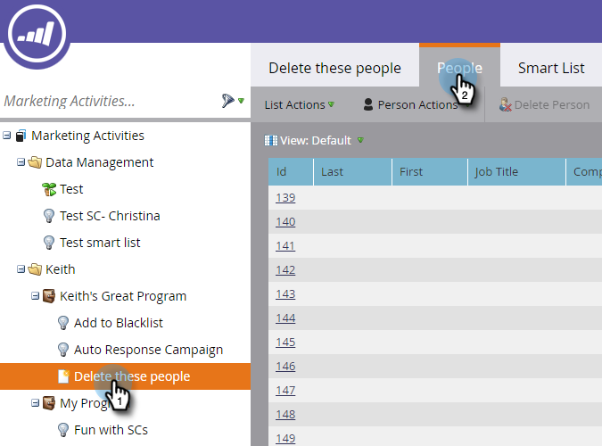
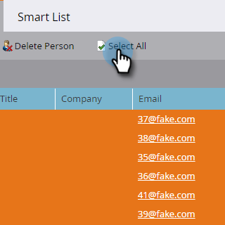

# Personen in een slimme lijst of lijst verwijderen {#delete-people-in-a-smart-list-or-list}

U kunt snel en gemakkelijk sommige/alle mensen schrappen die in een lijst of een Slimme Lijst zijn.

>[!PREREQUISITES]
>
>[ creeer een Slimme Lijst ](/help/marketo/product-docs/core-marketo-concepts/smart-lists-and-static-lists/creating-a-smart-list/create-a-smart-list.md)

1. Ga naar **[!UICONTROL Marketing Activities]** .

   

1. Selecteer de lijst/slimme lijst met alle personen die u wilt verwijderen en ga naar het tabblad **[!UICONTROL People]** .

   

   >[!CAUTION]
   >
   >Wanneer u een persoon verwijdert, verwijdert u deze niet alleen uit de lijst, maar wordt deze volledig uit de database verwijderd.

1. Klik op **[!UICONTROL Select All]**. U kunt ook een paar records selecteren door op Ctrl/Cmd te klikken.

   

   >[!NOTE]
   >
   >Als de resultaten zich uitstrekken over meerdere pagina&#39;s, worden door te klikken op **[!UICONTROL Select All]** alle personen op alle pagina&#39;s geselecteerd.

1. Klik op **[!UICONTROL Delete Person]** om de personen volledig uit Marketo te verwijderen.

   

1. Stel **[!UICONTROL Remove from CRM]** in op **[!UICONTROL true]** als u de records ook van uw CRM wilt verwijderen.

   

   >[!CAUTION]
   >
   >Als u Marketo en uw CRM verwijdert, kunt u nooit in een van beide systemen herstellen. De mensen en hun geschiedenis zullen voor altijd verdwenen zijn. Als u ze later weer toevoegt, worden ze behandeld als gloednieuwe records.

   >[!NOTE]
   >
   >Als uw Marketo niet is gekoppeld aan uw CRM, wordt de optie grijs weergegeven als in de schermafbeelding.

1. Klik op **[!UICONTROL Run Now]**.

   

1. Als u meer dan 50 personen verwijdert, ziet u dit. Typ het aantal personen dat u wilt verwijderen, schakel het selectievakje **[!UICONTROL Cannot Undo]** in en klik op **[!UICONTROL Delete]** .

   

   >[!NOTE]
   >
   >Klik op **[!UICONTROL View Results]** in het pop-upvenster Handeling voor één stroom rechtsboven in het scherm om de resultaten van de massale verwijdering weer te geven. De tijden van schrapping kunnen zeer variëren, afhankelijk van veelvoudige factoren.

   Dit is een fantastische functie, maar wees voorzichtig als u deze gebruikt!
