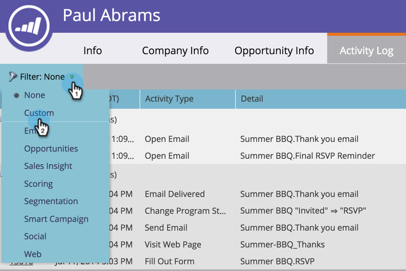

# Typen filteractiviteiten in het activiteitenlog van een persoon {#filter-activity-types-in-the-activity-log-of-a-person}

Zoek naar activiteiten die het belangrijkst voor u in het activiteitenlogboek zijn.

>[!NOTE]
>
>Leer meer over [ het activiteitenlogboek ](/help/marketo/product-docs/core-marketo-concepts/smart-lists-and-static-lists/managing-people-in-smart-lists/locate-the-activity-log-for-a-person.md){target="_blank"}.

1. Ga naar de pagina Details persoon. Klik op de tab **[!UICONTROL Activity Log]** .

   

1. Selecteer de vervolgkeuzelijst **[!UICONTROL Filter]** .

   

## Aangepaste filters maken {#creating-custom-filters}

1. Klik op de vervolgkeuzelijst **[!UICONTROL Filter]** . Selecteer **[!UICONTROL Custom]**.

   

1. Selecteer activiteiten waarop u wilt filteren. Klik op **[!UICONTROL Save As]**.

   

1. Voer een **[!UICONTROL custom filter name]** in. Klik op **[!UICONTROL Save]**.

   

   Alleen activiteiten van personen die voldoen aan de criteria van het filter worden weergegeven.

   

## Verwijzing opgeslagen filters {#reference-saved-filters}

Opgeslagen filters zijn toegankelijk via de vervolgkeuzelijst [!UICONTROL Filter] .

1. Klik op de vervolgkeuzelijst **[!UICONTROL Filters]** . Selecteer **[!UICONTROL Custom]**.

   

1. Klik op **[!UICONTROL Saved Filters]**. Opgeslagen filters worden hieronder weergegeven.

   
