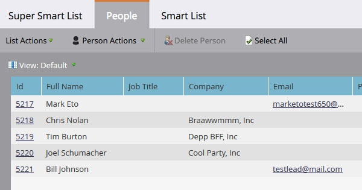

# Alle personen zoeken in een omzettingsfase {#find-all-people-in-a-revenue-stage}

>[!PREREQUISITES]
>
>[Een slimme lijst maken](/help/marketo/product-docs/core-marketo-concepts/smart-lists-and-static-lists/creating-a-smart-list/create-a-smart-list.md){target="_blank"}

## Zoeken naar alle leden van een specifieke omzettingsfase {#find-all-members-of-a-specific-revenue-stage}

1. Klik in een slimme lijst op de knop **[!UICONTROL Smart List]** tabblad, zoekt u de **[!UICONTROL Revenue Stage]** en sleep het naar het canvas.

   

1. Selecteer een **[!UICONTROL Revenue Stage]**.

   

1. Ga naar de **[!UICONTROL People]** om de resultaten weer te geven.

   

## Een stap-stap uitvoeren op de leden van een omzettingsfase {#run-a-flow-step-on-the-members-of-a-revenue-stage}

Nu u weet in welke inkomstenstadia de mensen zich bevinden, kunt u ze rechtstreeks op de markt brengen. Behalve kiezen **[!UICONTROL Revenue Stage]** als een slim lijstfilter, kunt u het als &quot;als&quot;filter in de stroom ook kiezen.

1. Klik in de gewenste stap op **[!UICONTROL Add Choice]** en selecteert u **[!UICONTROL Revenue Stage]** in de vervolgkeuzelijst.

   

   Van daar kunt u kiezen welke leden door welk aspect van de stroomstap worden beïnvloed.
