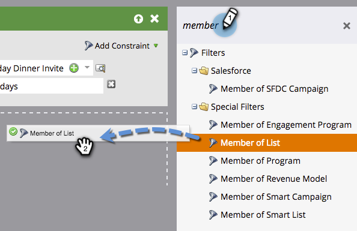

# Leden van lijst gebruiken in een slimme lijst {#use-members-of-list-in-a-smart-list}

>[!TIP]
>
>U kunt mensen aan een lijst toevoegen gebruikend de [Invoer](../../../../getting-started/quick-wins/import-a-list-of-people.md) of [voeg aan de stroomstap](../../../../product-docs/core-marketo-concepts/smart-campaigns/flow-actions/add-to-list.md)van de Lijst toe.

Met dit filter kunt u leden uit een andere lijst trekken door ernaar te verwijzen in de slimme-lijstregels. Zo gaat het.

1. Selecteer een slimme lijst en klik op het tabblad **Slimme lijst** .

   

1. Zoek in het venster met filters aan de rechterkant naar het filter **Lid van lijst** en sleep dit naar het canvas.

   

1. Klik op de vervolgkeuzelijst of typ om de lijst te zoeken die u in de slimme lijst wilt opnemen.

   

   **Gereed!** In dit voorbeeld richt de slimme lijst zich nu alleen op leden van die lijst en evalueert ze op basis van andere regels die u opneemt.

