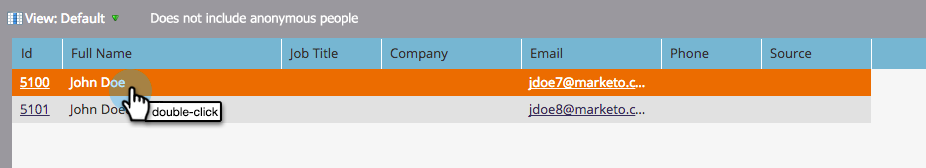

# De detailpagina voor personen gebruiken {#using-the-person-detail-page}

De pagina met persoonlijke details bevat alle informatie die Marketo over een persoon weet. U kunt gegevens rechtstreeks vanaf deze pagina bewerken.

>[!NOTE]
>
>**FYI**
>
>Marketo is nu bezig met het standaardiseren van de taal voor alle abonnementen, dus u ziet mogelijk leads/leads in uw abonnement en personen/personen in docs.marketo.com. Deze termen betekenen hetzelfde. het heeft geen invloed op de instructies van het artikel . Er zijn nog enkele andere veranderingen. [Meer](http://docs.marketo.com/display/DOCS/Updates+to+Marketo+Terminology)informatie.

## Aan Personen met detailpagina {#getting-to-person-detail-page}

Er zijn veel manieren om specifieke mensen te openen. Enkele voorbeelden worden hieronder weergegeven.

>[!NOTE]
>
>**Voorbeeld**
>
>* Vanuit de **database** kunt u zoeken in de snelkoppeling
>* Willekeurige slimme **lijst** of lijst
>* **Tabblad Leden** van een programma
>* **Campagneleden** weergeven in een slimme campagne
>* Sommige **rapporten**

>

1. Dubbelklik op een willekeurige persoon of klik op de id aan de linkerkant.

   

1. Hiermee wordt het detailscherm van de persoon geopend.

   

## Paginaorganisatie - Salesforce {#page-organization-salesforce}

Persoonsgegevens worden gecategoriseerd in de volgende tabbladen:

| Tab | Beschrijving |
|---|---|
| Info | Contactgegevens en aangepaste velden voor een persoon. |
| Bedrijfsinfo | Informatie en adres van het bedrijf van de persoon. |
| Informatie over opportunity | Opportunity-informatie gesynchroniseerd vanuit Salesforce. |
| SFDC Lead Field | Ingebouwde Salesforce-velden. |
| Aangepast SFDC-veld | Aangepaste Salesforce-velden. |
| Activiteitenlogboek | Alle activiteiten met betrekking tot de persoon. |

## Paginaorganisatie - Microsoft Dynamics {#page-organization-microsoft-dynamics}

| Tab | Beschrijving |
|---|---|
| Info | Contactgegevens en aangepaste velden voor een persoon. |
| Bedrijfsinfo | Informatie en adres van het bedrijf van de persoon. |
| Informatie over opportunity | Opportunity-informatie gesynchroniseerd vanuit Microsoft. |
| Aangepaste Microsoft-velden | Aangepaste Microsoft-velden. |
| Microsoft Lead Field | Ingebouwde Microsoft-velden. |
| Activiteitenlogboek | Alle activiteiten met betrekking tot de persoon. |

## Een veld bewerken {#editing-a-field}

Veel velden kunnen worden bewerkt. Als u de gegevens van een persoon wilt bijwerken, typt u een nieuwe waarde en klikt u buiten het veld dat u wilt opslaan.

## Marketo Default Fields before CRM Sync {#marketo-default-fields-prior-to-crm-sync}

|  |  |  |  |  |
|---|---|---|---|---|
| Adres | Jaarlijkse inkomsten | Anonieme IP | Factuuradres | Factureringsplaats |
| Factureringsland | Postcode facturering | Factureringsstatus | Plaats | Bedrijfsnaam |
| Land | Gemaakt op | Geboortedatum | Afdeling | Niet bellen |
| Geen oorzaak aanroepen | Reden niet aanroepen | E-mailadres | E-mail ongeldig | Ongeldige oorzaak e-mail |
| Externe bedrijfs-id | Id externe verkoper | Faxnummer | Voornaam | Volledige naam |
| Industrie | Overgenomen stad | Overgenomen onderneming | Overgenomen land | Overgenomen metropolitaans gebied |
| Gebiedscode afgeleide telefoon | Postcode | Gebied van de betrokken staat | Is anoniem | Is klant |
| Is partner | Functie | Achternaam | Classificatie | Score |
| Bron persoon | Status | Hoofdtelefoon | Marketo Social Facebook Display Name | Marketo Social Facebook-id |
| Foto-URL Marketo Social | URL Marketo Social Facebook-profiel | Marketo Social Facebook Reach | Marketo Social Facebook-inschrijvingen | Marketo Social Facebook bezoeken |
| Marketo Social Gender | Marketo Social laatst vermelde inschrijving | Marketo Social (laatst) bezoeken | Weergavenaam Marketo Social LinkedIn | Marketo Social LinkedIn-id |
| URL van Marketo Social LinkedIn-foto | URL Marketo Social LinkedIn-profiel | Marketo Social LinkedIn Reach | Marketo Social LinkedIn-inschrijvingen waarnaar wordt verwezen | Marketo Social LinkedIn bezoeken waarnaar wordt verwezen |
| Marketo Social Syndication ID | Marketo Social Total Verwezen inschrijvingen | Marketo Social Total Verwezen bezoeken | Weergavenaam Marketo Social Twitter | Marketo Social Twitter-id |
| Foto-URL Marketo Social Twitter | URL Marketo Social Twitter-profiel | Marketo Social Twitter Reach | Inschrijvingen op Marketo Social Twitter | Bezoeken op Marketo Social Twitter |
| Tweede voornaam | Mobiel telefoonnummer | Aantal werknemers | Telefoonnummer | Postcode |
| Prioriteit | Relatieve score | Rol | Aanhef | SIC-code |
| Site | Staat | Abonnement opgezegd | Reden waarop geen abonnement is genomen | Bijgewerkt op |
| Urgentie | Website |  |  |  |

>[!NOTE]
>
>**Diep duiken**
>
>Sommige velden kunnen *niet* worden bewerkt:
>
>* Bedrijfsgegevens
>* Mogelijkheden voor SFDC-contactpersonen
>* Bepaalde Marketo-specifieke velden, zoals Aanmaakdatum en Oorspronkelijk brontype.
>* Activiteitenlogboek

>
>
Meer informatie over [door het systeem beheerde velden](../../../../product-docs/administration/field-management/understanding-system-managed-fields.md).

>[!NOTE]
>
>**Verwante artikelen**
>
>* [Een aangepast tabblad maken voor de detailpagina voor personen](../../../../product-docs/administration/settings/creating-a-custom-tab-for-the-person-detail-page.md)

>

