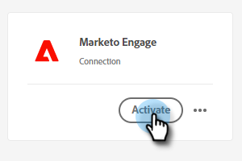
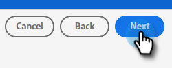

# Een Adobe Experience Cloud-segment naar een statische Marketo-lijst verplaatsen {#push-an-adobe-experience-cloud-segment-to-a-marketo-static-list}

Met deze functie kunt u segmenten in uw Adobe Experience Platform naar Marketo duwen in de vorm van een statische lijst.

>[!PREREQUISITES]
>
>* [Maak een API-](/help/marketo/product-docs/administration/users-and-roles/create-an-api-only-user.md) gebruiker in Marketo.
>* Ga vervolgens naar **Admin** > **Launchpoint**. Zoek de naam van de rol u enkel creeerde en klik **Details van de Mening**. Kopieer en sla de informatie op in **Client ID** en **Client Secret**, aangezien u het voor deze functie zult nodig hebben.

1. Meld u aan bij [Adobe Experience Platform](https://experience.adobe.com/).

   

1. Klik op het rasterpictogram en selecteer **Experience Platform**.

   

1. Klik in de linkernav op **Doelen**.

   

1. Klik **Catalogus**.

   

1. Zoek de tegel Marketo Engage en klik **Activeren**.

   

1. Klik onder Accounttype op het keuzerondje **Nieuw account**. Voer uw Marketo-gegevens in en klik op **Verbinding maken met doel**.

   

   >[!NOTE]
   >
   >U kunt uw Munchkin-id vinden door naar **Admin** > **Munchkin** te gaan (het is ook onderdeel van uw Marketo-URL wanneer u zich hebt aangemeld). Client-id/geheim die u nodig hebt, kan de voorwaarden boven aan dit artikel volgen.

1. &quot;Verbonden&quot; moet onder uw referenties worden weergegeven. Klik **Volgende** in de hogere juiste hoek.

   

1. Voer een **Naam** en een _optionele_ Beschrijving in. Klik **Doel maken**.

   >[!NOTE]
   >
   >Het kiezen van iets van de Handelingen van de Marketing is ook facultatief. Marketo maakt momenteel geen gebruik van die informatie, maar zal dat waarschijnlijk binnenkort doen.

   

1. Klik **Volgende**.

   

1. Kies het gewenste segment en klik op **Volgende**.

   

   >[!NOTE]
   >
   >Segmenten naar statische lijsten zijn 1:1. Als u hier veelvoudige segmenten kiest, zult u elk segment aan een gespecificeerde statische lijst op het lusje van het Programma van het Segment moeten in kaart brengen.

1. Klik **Nieuwe toewijzing toevoegen**.

   

1. Klik op het cursorpictogram.

   

1. Kies het keuzerondje **Kenmerken selecteren** of **Naamruimte selecteren** (in dit voorbeeld kiezen we Kenmerken).

   

   >[!NOTE]
   >
   >Als u **Identiteitsnaam naamruimte** kiest, gaat u na het maken van de selectie verder met stap 15.

1. Kies het relevante veld dat het e-mailadres bevat dat de gebruiker identificeert. Klik **Selecteer** wanneer gereed.

   

   

   >[!NOTE]
   >
   >Het gekozen voorbeeld kan er veel anders uitzien dan uw selectie.

1. Klik op het toewijzingspictogram.

   

1. Kies uw Gebied van het Doel en klik **Select**.

   

1. Klik **Volgende**.

   

1. _Maak in Marketo_ een statische lijst of zoek en selecteer een lijst die u al hebt gemaakt. Kopieer de toewijzing-id van het einde van de URL.

   

   >[!NOTE]
   >
   >Voor de beste resultaten moet de lijst waarnaar u verwijst in Marketo leeg zijn.

1. Voer in Adobe Experience Platform de id in die u zojuist hebt gekopieerd. Kies uw begindatum. Personen worden voortdurend gesynchroniseerd tot de gekozen einddatum. Voor een onbepaalde synchronisatie laat u de einddatum leeg. Klik **Volgende** wanneer gereed.

   

1. Bevestig uw wijzigingen en klik op **Voltooien**.

   
