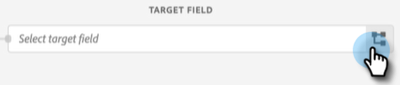

# Een Adobe Experience Platform-segment naar een statische Marketo-lijst verplaatsen {#push-an-adobe-experience-platform-segment-to-a-marketo-static-list}

Met deze functie kunt u segmenten in uw Adobe Experience Platform naar Marketo Engage duwen in de vorm van een statische lijst.

>[!PREREQUISITES]
>
>* [ geef de API Rol ](/help/marketo/product-docs/administration/users-and-roles/create-delete-edit-and-change-a-user-role.md#edit-an-existing-role){target="_blank"} uit om ervoor te zorgen het **lees-schrijf Persoon** toestemming heeft (die onder de toegang API drop-down wordt gevonden).
>* [ creeer een Gebruiker van API ](/help/marketo/product-docs/administration/users-and-roles/create-an-api-only-user.md){target="_blank"} in Marketo.
>* Ga naar **[!UICONTROL Admin]** > **[!UICONTROL Launchpoint]** . Zoek de naam van de rol die u net hebt gemaakt en klik op **[!UICONTROL View Details]** . Kopieer en sla de informatie op in **[!UICONTROL Client ID]** en **[!UICONTROL Client Secret]** , zoals u deze nodig hebt voor stap 7.
>* Maak in Marketo een statische lijst of zoek en selecteer een lijst die u al hebt gemaakt. Je hebt de id nodig.

1. Login aan [ Adobe Experience Platform ](https://experience.adobe.com/){target="_blank"}.

   

1. Klik op het rasterpictogram en selecteer **[!UICONTROL Experience Platform]** .

   

1. Klik in de linkernav op **[!UICONTROL Destinations]** .

   

1. Klik op **[!UICONTROL Catalog]**.

   

1. Zoek de tegel Marketo Engage en klik op **[!UICONTROL Activate]** .

   

1. Klik op **[!UICONTROL Configure New Destination]**.

   

1. Selecteer onder Accounttype het keuzerondje Bestaande of Nieuwe account (in dit voorbeeld kiezen we **[!UICONTROL Existing Account]** ). Klik op het pictogram Account selecteren.

   

   >[!NOTE]
   >
   >Als u Nieuwe account kiest, gaat u naar **[!UICONTROL Admin]** > **[!UICONTROL Munchkin]** om uw Munchkin-id te zoeken (deze maakt ook deel uit van uw Marketo-URL wanneer u zich hebt aangemeld). Client-id/geheim die u nodig hebt, kan de voorwaarden boven aan dit artikel volgen.

1. Kies het doelaccount en klik op **[!UICONTROL Select]** .

   

1. Voer een doel **[!UICONTROL Name]** en een optionele beschrijving in. Klik op de vervolgkeuzelijst Personen maken en kies &quot;Bestaande Marketo-personen afstemmen en Ontbrekende personen maken in Marketo&quot; _of_ &quot;Alleen bestaande Marketo-personen afstemmen&quot; (in dit voorbeeld kiezen we de eerste persoon). U moet ook een **[!UICONTROL Workspace]** kiezen.

   

   >[!NOTE]
   >
   >Als u &quot;[!UICONTROL Match Existing Marketo People Only]&quot;kiest zult u slechts e-mail en/of ECID moeten in kaart brengen, zodat kunt u Stappen 13-16 overslaan.

1. Deze sectie is optioneel. Klik op **[!UICONTROL Create]** om over te slaan.

   

1. Selecteer het doel dat u hebt gemaakt en klik op **[!UICONTROL Next]** .

   

1. Kies het segment dat u naar Marketo wilt verzenden en klik op **[!UICONTROL Next]** .

   

   >[!NOTE]
   >
   >Als u meerdere segmenten kiest, moet u elk segment toewijzen aan een opgegeven statische lijst op het tabblad [!UICONTROL Segment Schedule] .

   >[!IMPORTANT]
   >
   >Nadat een segment aan de bestemming van Marketo voor het eerst is geactiveerd, kan het terugvullen van profielen die reeds in het segment voorafgaand aan de bestemmingsactivering van Marketo bestaan _tot 24 uren_ nemen. Als er tijdprofielen aan het segment worden toegevoegd, worden deze meteen aan Marketo toegevoegd.

1. Klik op **[!UICONTROL Add New Mapping]**.

   

1. Klik op het toewijzingspictogram.

   

1. Kies de gewenste kenmerken en klik op **[!UICONTROL Select]** . In dit voorbeeld kiezen we voor voornaam, achternaam en e-mailadres.

   

   >[!NOTE]
   >
   >U kunt kenmerken van Experience Platform toewijzen aan alle kenmerken waartoe uw organisatie in Marketo Engage toegang heeft. Gebruik [ beschrijf API verzoek ](https://experienceleague.adobe.com/en/docs/marketo-developer/marketo/rest/lead-database/lead-database#describe){target="_blank"} om attributengebieden terug te winnen die uw organisatie toegang heeft tot.

1. Wijs Achternaam en Bedrijfsnaam toe door nogmaals op **[!UICONTROL Add New Mapping]** te klikken en Stap 15 tweemaal te herhalen. Kies vervolgens **[!UICONTROL lastName]** en **[!UICONTROL companyName]** .

   

1. Nu is het tijd om het e-mailadres toe te wijzen. Klik nogmaals op **[!UICONTROL Add New Mapping]** .

   

1. Klik op het toewijzingspictogram.

   

1. Klik op het keuzerondje Identiteitsnaamruimte selecteren, kies **[!UICONTROL Email]** en klik op **[!UICONTROL Select]** .

   

   >[!IMPORTANT]
   >
   >Het toewijzen van e-mail- en/of ECID via het tabblad **[!UICONTROL Identity Namespace]** is het belangrijkste wat u moet doen om ervoor te zorgen dat de persoon in Marketo gelijk is aan de persoon. Toewijzingse-mail zorgt voor de hoogste overeenkomende snelheid.

1. Nu is het tijd om de bronvelden te kiezen. Klik op het cursorpictogram voor e-mail.

   

1. Klik op het keuzerondje Identiteitsnaamruimte selecteren, zoek en selecteer **[!UICONTROL Email]** en klik vervolgens op **[!UICONTROL Select]** .

   

1. Klik op het cursorpictogram in de rij om het bronveld Bedrijfsnaam te kiezen.

   

1. Laat het keuzerondje Kenmerken selecteren ingeschakeld. Zoek naar &quot;bedrijf&quot;en selecteer **[!UICONTROL companyName]**, dan klik **[!UICONTROL Select]**.

   

1. Wijs de bronvelden voor Achternaam en Voornaam toe door op het cursorpictogram voor elke velden te klikken en Stap 23 tweemaal te herhalen. Kies vervolgens **[!UICONTROL lastName]** en **[!UICONTROL firstName]** .

   

1. Klik op **[!UICONTROL Next]**.

   

1. Controleer uw wijzigingen en klik op **[!UICONTROL Finish]** .

   
