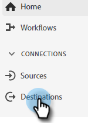

# Een Adobe Experience Platform-segment naar een statische Marketo-lijst verplaatsen {#push-an-adobe-experience-platform-segment-to-a-marketo-static-list}

Met deze functie kunt u segmenten in uw Adobe Experience Platform op het Marketo Engage plaatsen in de vorm van een statische lijst.

>[!PREREQUISITES]
>
>* [De API-rol bewerken](/help/marketo/product-docs/administration/users-and-roles/create-delete-edit-and-change-a-user-role.md#edit-an-existing-role){target="_blank"} om ervoor te zorgen dat de **Leesschrijfpersoon** machtiging (gevonden onder de vervolgkeuzelijst Toegang API).
>* [Een API-gebruiker maken](/help/marketo/product-docs/administration/users-and-roles/create-an-api-only-user.md){target="_blank"} in Marketo.
>* Ga naar **[!UICONTROL Admin]** > **[!UICONTROL Launchpoint]**. Zoek de naam van de rol die u net hebt gemaakt en klik op **[!UICONTROL View Details]**. De gegevens kopiëren en opslaan in **[!UICONTROL Client ID]** en **[!UICONTROL Client Secret]**, aangezien u het voor Stap 7 kon nodig hebben.
>* Maak in Marketo een statische lijst of zoek en selecteer een lijst die u al hebt gemaakt. Je hebt de id nodig.

1. Aanmelden bij [Adobe Experience Platform](https://experience.adobe.com/){target="_blank"}.

   

1. Klik op het rasterpictogram en selecteer **[!UICONTROL Experience Platform]**.

   

1. Klik in de linkernav op **[!UICONTROL Destinations]**.

   

1. Klik op **[!UICONTROL Catalog]**.

   

1. De tegel Marketo Engage zoeken en klikken **[!UICONTROL Activate]**.

   

1. Klik op **[!UICONTROL Configure New Destination]**.

   

1. Selecteer onder Accounttype het keuzerondje Bestaande of Nieuwe account (in dit voorbeeld kiezen we **[!UICONTROL Existing Account]**). Klik op het pictogram Account selecteren.

   

   >[!NOTE]
   >
   >Als u Nieuwe account kiest, kunt u naar de Munchkin-id gaan **[!UICONTROL Admin]** > **[!UICONTROL Munchkin]** (het maakt ook deel uit van uw Marketo-URL wanneer u zich hebt aangemeld). Client-id/geheim die u nodig hebt, kan de voorwaarden boven aan dit artikel volgen.

1. Kies het bestemmingsaccount en klik op **[!UICONTROL Select]**.

   

1. Voer een bestemming in **[!UICONTROL Name]** en een optionele beschrijving. Klik op de vervolgkeuzelijst Personen maken en kies &quot;Identieke bestaande Marketo-personen en Ontbrekende personen maken in Marketo&quot; _of_ &quot;Alleen bestaande Marketo-personen afstemmen&quot; (in dit voorbeeld kiezen we de eerste persoon). U moet ook een **[!UICONTROL Workspace]**.

   

   >[!NOTE]
   >
   >Als u Alleen bestaande Marketo-personen afstemmen kiest, hoeft u alleen de e-mail en/of de ECID toe te wijzen, zodat u de stappen 13 tot en met 16 kunt overslaan.

1. Deze sectie is optioneel. Klikken **[!UICONTROL Create]** overslaan.

   

1. Selecteer de bestemming u creeerde en klik **[!UICONTROL Next]**.

   

1. Kies het segment dat u naar Marketo wilt verzenden en klik op **[!UICONTROL Next]**.

   

   >[!NOTE]
   >
   >Als u veelvoudige segmenten kiest, zult u elk segment aan een gespecificeerde statische lijst op het lusje van het Programma van het Segment moeten in kaart brengen.

   >[!IMPORTANT]
   >
   >Nadat een segment voor het eerst is geactiveerd naar de Marketo-bestemming, kunnen back-upprofielen die al bestonden in het segment vóór de Marketo-doelactivering worden gebruikt _tot 24 uur_. Als er tijdprofielen aan het segment worden toegevoegd, worden deze meteen aan Marketo toegevoegd.

1. Klik op **[!UICONTROL Add New Mapping]**.

   

1. Klik op het toewijzingspictogram.

   

1. Kies de gewenste kenmerken en klik op **[!UICONTROL Select]**. In dit voorbeeld kiezen we voor voornaam, achternaam en e-mailadres.

   

   >[!NOTE]
   >
   >U kunt attributen van Experience Platform aan om het even welke attributen in kaart brengen die uw organisatie in Marketo Engage toegang heeft tot. Gebruik de [Beschrijf API-aanvraag](https://experienceleague.adobe.com/en/docs/marketo-developer/marketo/rest/lead-database/lead-database#describe){target="_blank"} om kenmerkvelden op te halen waartoe uw organisatie toegang heeft.

1. Wijs de Achternaam en de Naam van het Bedrijf in kaart door te klikken **[!UICONTROL Add New Mapping]** en herhaalt u stap 15 tweemaal, waarbij u **[!UICONTROL lastName]** en vervolgens **[!UICONTROL companyName]**.

   

1. Nu is het tijd om het e-mailadres toe te wijzen. Klikken **[!UICONTROL Add New Mapping]** opnieuw.

   

1. Klik op het toewijzingspictogram.

   

1. Klik op het keuzerondje Identiteitsnaamruimte selecteren en kies **[!UICONTROL Email]** en klik vervolgens op **[!UICONTROL Select]**.

   

   >[!IMPORTANT]
   >
   >E-mail en/of ECID toewijzen via de **[!UICONTROL Identity Namespace]** -tab is het belangrijkste om ervoor te zorgen dat de persoon in Marketo gelijk wordt behandeld. Toewijzingse-mail zorgt voor de hoogste overeenkomende snelheid.

1. Nu is het tijd om de bronvelden te kiezen. Klik op het cursorpictogram voor e-mail.

   

1. Klik op het keuzerondje Identiteitsnaamruimte selecteren, zoek en selecteer **[!UICONTROL Email]** en klik vervolgens op **[!UICONTROL Select]**.

   

1. Klik op het cursorpictogram in de rij om het bronveld Bedrijfsnaam te kiezen.

   

1. Laat het keuzerondje Kenmerken selecteren ingeschakeld. Zoek naar &quot;bedrijf&quot; en selecteer **[!UICONTROL companyName]** en klik vervolgens op **[!UICONTROL Select]**.

   

1. Wijs de brongebieden voor Achternaam en Voornaam door het curseurpictogram voor elk te klikken en Stap 23 tweemaal te herhalen, kiezen **[!UICONTROL lastName]** en vervolgens **[!UICONTROL firstName]**.

   

1. Klik op **[!UICONTROL Next]**.

   

1. Controleer uw wijzigingen en klik op **[!UICONTROL Finish]**.

   
