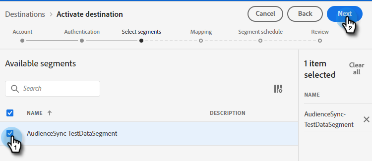

# Een Adobe Experience Platform-segment naar een statische Marketo-lijst verplaatsen {#push-an-adobe-experience-platform-segment-to-a-marketo-static-list}

Met deze functie kunt u segmenten in uw Adobe Experience Platform naar Marketo duwen in de vorm van een statische lijst.

>[!PREREQUISITES]
>
>* [Een API-gebruiker maken](/help/marketo/product-docs/administration/users-and-roles/create-an-api-only-user.md) in Marketo.
>* Ga vervolgens naar **Beheer** > **Launchpoint**. Zoek de naam van de rol die u net hebt gemaakt en klik op **Details weergeven**. De gegevens kopiëren en opslaan in **Client-id** en **Clientgeheim**, aangezien u het voor deze eigenschap zult nodig hebben.

1. Aanmelden bij [Adobe Experience Platform](https://experience.adobe.com/).

   

1. Klik op het rasterpictogram en selecteer **Experience Platform**.

   

1. Klik in de linkernav op **Doelen**.

   

1. Klikken **Catalogus**.

   

1. De tegel Marketo Engage zoeken en klikken **Segmenten activeren**.

   

1. Klikken **Nieuwe bestemming configureren**.

1. Klik onder Accounttype op de knop **Nieuw account** keuzerondje. Voer uw Marketo-gegevens in en klik op **Verbinden met doel**.

   

   >[!NOTE]
   >
   >Je kunt je Munchkin-id vinden door naar **Beheer** > **Munchkin** (het maakt ook deel uit van uw Marketo-URL wanneer u zich hebt aangemeld). Client-id/geheim die u nodig hebt, kan de voorwaarden boven aan dit artikel volgen.

1. &quot;Verbonden&quot; moet onder uw referenties worden weergegeven. Klikken **Volgende** in de rechterbovenhoek.

   

1. Voer een **Naam** en _optioneel_ Beschrijving. Klikken **Doel maken**.

   >[!NOTE]
   >
   >Het kiezen van iets van de Handelingen van de Marketing is ook facultatief. Marketo maakt momenteel geen gebruik van die informatie, maar zal dat waarschijnlijk binnenkort doen.

   

1. Klikken **Volgende**.

   

1. Kies het gewenste segment en klik op **Volgende**.

   

   >[!NOTE]
   >
   >Segmenten naar statische lijsten zijn 1:1. Als u hier veelvoudige segmenten kiest, zult u elk segment aan een gespecificeerde statische lijst op het lusje van het Programma van het Segment moeten in kaart brengen.

1. Klikken **Nieuwe toewijzing toevoegen**.

   

1. Klik op het cursorpictogram.

   

1. Kies een van de **Kenmerken selecteren** of **Identiteitsnaamruimte selecteren** keuzerondje (in dit voorbeeld kiezen we Kenmerken).

   

   >[!NOTE]
   >
   >Als u **Identiteitsnaamruimte selecteren** Ga na het maken van de selectie verder met Stap 15.

1. Kies het relevante veld dat het e-mailadres bevat dat de gebruiker identificeert. Klikken **Selecteren** wanneer gereed.

   

   

   >[!NOTE]
   >
   >Het gekozen voorbeeld kan er veel anders uitzien dan uw selectie.

1. Klik op het toewijzingspictogram.

   

1. Kies **Identiteitsnaamruimte selecteren**.

   

   >[!IMPORTANT]
   >
   >Toewijzingskenmerken zijn optioneel. E-mail en/of ECID toewijzen via de **Naamruimte van identiteit** -tab is het belangrijkste om ervoor te zorgen dat de persoon in Marketo gelijk wordt behandeld. Toewijzingse-mail zorgt voor de hoogste overeenkomende snelheid.

1. Kies tussen ECID of E-mail. In dit voorbeeld kiezen we **E-mail**.

   

1. Klikken **Volgende**.

   

   >[!NOTE]
   >
   >De identiteiten worden gebruikt om gelijken in Marketo te zoeken. Als een gelijke wordt gevonden, wordt de persoon toegevoegd aan de statische Lijst. Als er geen overeenkomst wordt gevonden, worden deze personen verwijderd (dus niet gemaakt in Marketo).

1. _In Marketo_, maakt u een statische lijst of zoekt en selecteert u een lijst die u al hebt gemaakt. Kopieer de toewijzing-id van het einde van de URL.

   

   >[!NOTE]
   >
   >Voor de beste resultaten moet de lijst waarnaar u verwijst in Marketo leeg zijn.

1. Voer in Adobe Experience Platform de id in die u zojuist hebt gekopieerd. Kies uw begindatum. Personen worden voortdurend gesynchroniseerd tot de gekozen einddatum. Voor een onbepaalde synchronisatie laat u de einddatum leeg. Klikken **Volgende** wanneer gereed.

   

1. Bevestig uw wijzigingen en klik op **Voltooien**.

   
