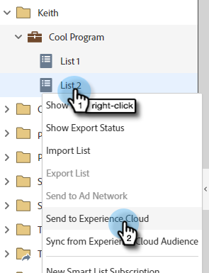

# Een lijst naar Adobe Experience Cloud verzenden {#send-a-list-to-adobe-experience-cloud}

>[!NOTE]
>
>Een plaatsing HIPAA-klaar van een instantie van het Marketo Engage kan deze eigenschap niet gebruiken.

>[!PREREQUISITES]
>
>[ Toewijzing van de Organisatie van de Adobe van de opstelling ](/help/marketo/product-docs/adobe-experience-cloud-integrations/set-up-adobe-organization-mapping.md){target="_blank"}

## Ondersteunde doeltoepassingen {#supported-destination-applications}

* Adobe Advertising Cloud
* Adobe Analytics (_slechts_ als u een Vergunning van Adobe Audience Manager bezit)
* Adobe Audience Manager
* Adobe Experience Manager
* Adobe Real-time Customer Data Platform
* Adobe Target

## Hoe te om een Statische Lijst te verzenden {#how-to-send-a-static-list}

Een statische lijst is dat, statisch. De lijst wordt alleen gewijzigd in Adobe Experience Cloud als u deze handmatig aanbrengt.

1. Zoek in Marketo de lijst die u wilt exporteren. Klik er met de rechtermuisknop op en selecteer **[!UICONTROL Send to Experience Cloud]** .

   

1. Klik op de vervolgkeuzelijst **[!UICONTROL Audience Manager Folder]** en selecteer de gewenste doelmap in het Experience Cloud.

   

1. Kies of u een nieuw publiek wilt maken of een bestaand publiek wilt overschrijven (in dit voorbeeld maken we een nieuw publiek). Voer de nieuwe publieksnaam in en klik op **[!UICONTROL Send]** .

   

1. Klik op **[!UICONTROL OK]**.

   

   >[!NOTE]
   >
   >Het kan tot 6-8 uur duren voor het publiekslidmaatschap volledig in Adobe bevolkt.

## Een gesynchroniseerde lijst verzenden {#how-to-send-a-synced-list}

Als u een lijst synchroniseert, betekent dit dat telkens wanneer u een lijst in Marketo bijwerkt, deze lijst automatisch wordt gesynchroniseerd met de gebruikers in Adobe Experience Cloud.

1. Zoek in Marketo de lijst die u wilt exporteren. Klik er met de rechtermuisknop op en selecteer **[!UICONTROL Send to Experience Cloud]** .

   

1. Klik op de vervolgkeuzelijst **[!UICONTROL Audience Library Folder]** en selecteer de gewenste doelmap in het Experience Cloud.

   

1. Kies of u een nieuw publiek wilt maken of een bestaand publiek wilt overschrijven (in dit voorbeeld maken we een nieuw publiek). Voer de nieuwe publieksnaam in, schakel het selectievakje **[!UICONTROL Keep Audience Membership in Sync]** in en klik op **[!UICONTROL Send]** .

   

1. Klik **O  K**.

   

## Lijstsynchronisatie stoppen {#how-to-stop-a-list-sync}

U kunt de lijst op elk gewenst moment niet meer synchroniseren.

1. Zoek in Marketo naar de lijst die u niet meer wilt synchroniseren en klik met de rechtermuisknop. Klik op **[!UICONTROL Stop List Sync]**.

   

1. Selecteer de doelgroep of doelgroepen die u niet meer wilt synchroniseren en klik op **[!UICONTROL Stop]** .

   

1. Klik op **[!UICONTROL Stop]** om te bevestigen.

   

## Notities {#things-to-note}

**het Delen aan Adobe Analytics**

* Voor klanten die zowel Adobe Audience Manager als Adobe Analytics bezitten, zal deze integratie toelaten om publiek van Marketo aan uw Suites van het Rapport van Adobe Analytics te delen, nochtans zijn er sommige extra configuratiestappen die in Adobe Audience Manager moeten worden genomen om dit toe te laten. Gelieve te herzien {de documentatie van 0} Adobe Audience Manager [&#128279;](https://experienceleague.adobe.com/docs/analytics/integration/audience-analytics/mc-audiences-aam.html){target="_blank"}  voor meer informatie over hoe te opstelling dit.

* Als een lijst leeg is of geen personen met ECID-waarden heeft, wordt er niet naar de lijstnaam verwezen buiten het Marketo Engage.

**Het Gebruik van het Rand voor de Klanten van Adobe Audience Manager**

Als u een lijst exporteert in Marketo, ziet u de volgende wijzigingen die in uw Adobe Audience Manager-exemplaar worden doorgevoerd:

* Voor alle personen in de geëxporteerde lijst schrijft Marketo een kenmerk met hun gehashte e-mails als een id voor alle apparaten. De naam van het kenmerk komt overeen met de naam van het doelpubliek die u tijdens het exporteren hebt opgegeven.
* Voor alle ECID&#39;s die Marketo heeft kunnen koppelen aan de Personen in de geëxporteerde lijst, schrijft Marketo een kenmerk met de ECID-apparaatid. De naam van het kenmerk komt overeen met de naam van het doelpubliek die u tijdens het exporteren hebt opgegeven.
* Marketo zal ook een segment in uw Instantie van de Audience Manager tot stand brengen gebruikend het bezit ECID als enige segmenteringscriterium. De naam van het segment zal de Naam van het Publiek van de Bestemming aanpassen die u tijdens de uitvoer specificeerde.

## Veelgestelde vragen {#faq}

**waarom is de lijstgrootte in Marketo verschillend dan in Adobe?**

Onder de motorkap werkt de publieksintegratie door Marketo Munchkin cookies te synchroniseren met de bijbehorende Adobe ECID cookie. Marketo kan alleen lidmaatschapsgegevens delen voor mensen waarvoor Marketo een ECID heeft gesynchroniseerd. Voor de beste resultaten is het raadzaam om het trackingscript voor Marketo munchkin.js parallel met de trackingcode bezoekor.js van de Adobe te laden op alle pagina&#39;s die u voor marketingdoeleinden wilt bijhouden.

**hoe werkt de koekjessynchronisatie?**

Wanneer de cookiesync voor uw Marketo Abonnement wordt toegelaten, zal Marketo munchkin.js proberen om Adobe ECIDs voor de GOS van Adobe te vangen en op te slaan u tijdens de integratieopstelling specificeerde en deze ECIDs aan het overeenkomstige koekjesherkenningsteken van Marketo aan te passen. Hierdoor kunnen Marketo-profielen van anonieme gebruikers worden verrijkt met Adobe-ECID&#39;s.

Een volgende stap is vereist om het anonieme gebruikersprofiel aan een Profiel van de Persoon te associëren, dat gebruikend een gewone tekst e-mail wordt geïdentificeerd. Precies hoe dit werk [ wordt beschreven hier ](/help/marketo/product-docs/reporting/basic-reporting/report-activity/tracking-anonymous-activity-and-people.md){target="_blank"}.

**Welke informatie wordt gedeeld?**

Deze integratie deelt alleen de lidmaatschapsinformatie van Marketo naar Adobe (bijvoorbeeld de kennis dat Persoon X lid is van Lijst Y). Via deze integratie worden geen aanvullende Personkenmerken aan de Adobe gedeeld.
