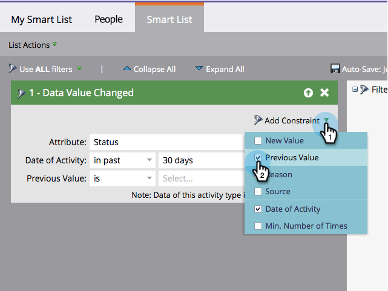

# Een restrictie toevoegen aan een slim lijstfilter {#add-a-constraint-to-a-smart-list-filter}

Bij het maken van een slimme lijst hebben sommige filters geavanceerde opties die &#39;beperkingen&#39; worden genoemd. Dit zijn extra voorwaarden die u kunt toevoegen aan filters en triggers om uw zoekopdracht nog verder te beperken.

In dit voorbeeld, voegen sommige beperkingen aan a toe **[Gewijzigde gegevenswaarde](/help/marketo/product-docs/core-marketo-concepts/smart-campaigns/flow-actions/change-data-value.md){target="_blank"}** te zoeken naar mensen met een statuswijziging van MQL in SQL.

>[!PREREQUISITES]
>
>* [Een slimme lijst maken](/help/marketo/product-docs/core-marketo-concepts/smart-lists-and-static-lists/creating-a-smart-list/create-a-smart-list.md){target="_blank"}
>* [Het filter &quot;Gewijzigde gegevenswaarde&quot; in een slimme lijst gebruiken](/help/marketo/product-docs/core-marketo-concepts/smart-lists-and-static-lists/using-smart-lists/use-the-data-value-changed-filter-in-a-smart-list.md){target="_blank"}

1. Ga naar **[!UICONTROL Marketing Activities]**.

   

1. Selecteer de slimme lijst met een filter waaraan u een beperking wilt toevoegen en klik op de knop **[!UICONTROL Smart List]** tab.

   

1. Selecteer onder **[!UICONTROL Add Constraint]** de optie **[!UICONTROL Previous Value]**.

   

1. Voer de **[!UICONTROL Previous Value]**. In dit voorbeeld gebruiken we MQL.

   

1. Selecteer onder **[!UICONTROL Add Constraint]** de optie **[!UICONTROL New Value]**.

   

1. Voer de nieuwe waarde in. In dit voorbeeld gebruiken we SQL.

   

1. Echt waar! Klik op de knop **[!UICONTROL People]** om alle personen te zien die de afgelopen 30 dagen een statuswijziging van &quot;MQL&quot; in &quot;SQL&quot; hadden.
