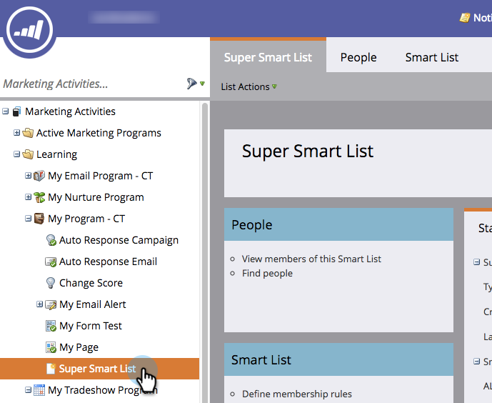

# Een lijst of slimme lijst klonen {#clone-a-list-or-smart-list}

In plaats van een slimme lijst helemaal zelf te maken, kunt u wat tijd besparen door een vergelijkbare lijst te klonen en wijzigingen aan te brengen. Zo gaat het.

1. Ga naar **[!UICONTROL Marketing Activities]**.

   

1. Selecteer de slimme lijst die u wilt klonen.

   

1. Onder **[!UICONTROL List Actions]**, klikt u op **[!UICONTROL Clone Smart List]**.

   

1. Voer een **[!UICONTROL Name]** en klik op **[!UICONTROL Clone]**.

   

Mooi werk! U kunt gewone lijsten ook op dezelfde manier klonen.
