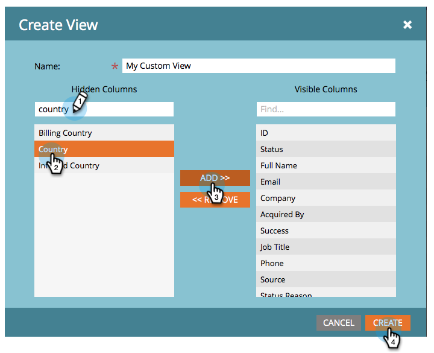

# Weergaven voor lijsten en slimme lijsten maken en wijzigen {#create-and-change-views-for-lists-and-smart-list}

In een slimme lijst wordt een standaardset kolommen weergegeven. Wist u dat u deze kolommen kunt bewerken in de inhoud van uw hart? Zo gaat het.

## Een weergave maken {#create-a-view}

1. Ga naar een lijst of slimme lijst, klik op de tab **[!UICONTROL People]** en klik op **[!UICONTROL Create View]** onder de vervolgkeuzelijst **[!UICONTROL View]** .

   

1. Geef de weergave een naam en zoek naar de kolom die u wilt toevoegen of verwijderen.

   

1. Voeg de gewenste kolommen toe of verwijder deze. Klik vervolgens op **[!UICONTROL Create]** .

   

>[!TIP]
>
>Om snel te zoeken, gebruik **Vondst** doos.

## Weergaven omwisselen {#switch-views}

1. Klik op de vervolgkeuzelijst **[!UICONTROL View]** en selecteer de gewenste weergave. Schakel indien nodig heen en weer tussen de weergaven.

   

>[!NOTE]
>
> Als u wilt schakelen tussen weergaven, moet u eerst een tweede weergave maken, naast de standaardweergave.

## Een weergave bewerken {#edit-a-view}

1. Controleer of de weergave die u wilt bewerken is geselecteerd in de vervolgkeuzelijst **[!UICONTROL View]** .

   

1. Klik op de optie **[!UICONTROL Edit]** .

   

1. Breng de gewenste wijzigingen aan en klik op **[!UICONTROL Save]** .

   

## Een weergave verwijderen {#delete-a-view}

1. Selecteer de optie **[!UICONTROL Edit]** voor de weergave die u uit de vervolgkeuzelijst **[!UICONTROL View]** wilt verwijderen.

   

1. Klik op **[!UICONTROL Delete]**.

   

Alleen u kunt de aangepaste weergaven zien die u maakt in de vervolgkeuzelijst Weergave. Vertel uw vrienden dus dat ze hun eigen weergaven moeten maken!

>[!MORELIKETHIS]
>
>* [ Ingebouwd van het Gebruik/de Slimme Lijsten van het Systeem ](/help/marketo/product-docs/core-marketo-concepts/smart-lists-and-static-lists/using-smart-lists/use-built-in-system-smart-lists.md){target="_blank"}
>* [ creeer een Slimme Lijst ](/help/marketo/product-docs/core-marketo-concepts/smart-lists-and-static-lists/creating-a-smart-list/create-a-smart-list.md){target="_blank"}
