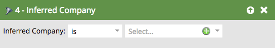

# Overgenomen filters {#inferred-filters}

Wanneer iemand uw website bezoekt, [ Munchkin ](/help/marketo/product-docs/administration/additional-integrations/add-munchkin-tracking-code-to-your-website.md){target="_blank"} koekjes hen en hen in het systeem zet. We zoeken hun IP op in een speciale database en sturen allerlei informatie uit.

>[!NOTE]
>
>Om ervoor te zorgen dat afgeleide veldwaarden actueel blijven, werken wij periodiek het gegevensbestand bij dat voor IP adresraadplegingen wordt gebruikt. Database-updates kunnen nieuwe afgeleide veldwaarden introduceren die u mogelijk moet toevoegen aan de filterdefinities Slimme lijst.
>
>De updates van het gegevensbestand kunnen tijdens a [ Marketo Engage productversie ](/help/marketo/release-notes/release-schedule.md){target="_blank"} voorkomen. Wanneer een update voorkomt, zullen de [ de versienota&#39;s van Marketo Engage ](/help/marketo/release-notes/current.md){target="_blank"} een verklaring van om het even welke veranderingen in afgeleide gebiedswaarden bevatten.

Wanneer u een van deze filters in een slimme lijst gebruikt, leveren de resultaten op dat mensen deze afgeleide informatie krijgen.

>[!TIP]
>
>Gebruik deze filters in een webactiviteitenrapport. Gebruik de gebieden van de verkoopvertegenwoordigers en onderteken deze in de afgelopen 24 uur aan een aangepast dagelijks rapport met websitebezoekers. Ze zullen het leuk vinden!
>
>* Bezochte webpagina - Laatste 24 uur
>* De afgeleide Staat is [ hun gebied ] selecteren

Deze anonieme bezoekers worden automatisch geconverteerd naar personen wanneer ze op een e-mailkoppeling klikken of een formulier invullen. Ze bewaren echter alle verzamelde informatie.

>[!NOTE]
>
>Leer meer over [ anonieme activiteit en leidt ](/help/marketo/product-docs/core-marketo-concepts/smart-lists-and-static-lists/managing-people-in-smart-lists/understanding-anonymous-activity-and-people.md){target="_blank"}.
