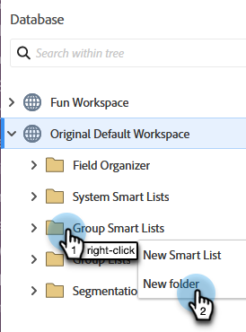
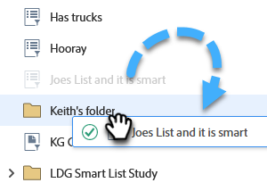

# Verwijzen naar een lijst of slimme lijst in werkruimten {#reference-a-list-or-smart-list-across-workspaces}

Lijsten en slimme lijsten kunnen worden gedeeld en van verwijzingen voorzien over werkruimten voor gemakkelijk hergebruik van het Gegevensbestand.

>[!NOTE]
>
>De verdelingsregels van de persoon zijn van toepassing (Slimme Lijsten en statische lijsten in een werkruimte tonen slechts mensen die zowel leden van de lijst _als_ leden van de huidige werkruimte zijn).

## Een lijst of slimme lijst delen {#share-a-list-or-smart-list}

1. Ga naar de **[!UICONTROL Database]** .

   

1. Klik met de rechtermuisknop op een campagnemap. Selecteer **[!UICONTROL New Folder]** .

   

   >[!NOTE]
   >
   >Assets kan alleen worden gedeeld door werkruimten als deze in een map zijn genest.

1. Geef de map een naam en klik op **[!UICONTROL Create]** .

   

1. Sleep een lijst of slimme lijst die u wilt delen naar de nieuwe map en zet deze neer.

   

1. Klik met de rechtermuisknop op de nieuwe map en selecteer **[!UICONTROL Share folder]** .

   

1. Kies een **[!UICONTROL Workspace]** die u wilt delen en klik op **[!UICONTROL Save]** .

   

   Geweldig! Deze lijst is nu beschikbaar in beide werkruimten.

   >[!NOTE]
   >
   >Bij marketingactiviteiten kunt u alleen mappen op hoofdniveau delen. In het Gegevensbestand, kunt u top-level omslagen evenals één niveau neer delen.
