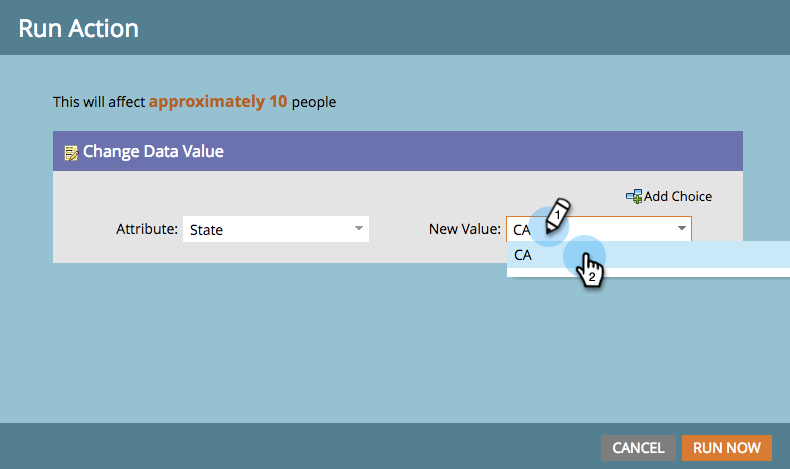

# Eén stroomstap uitvoeren vanuit een slimme lijst {#run-a-single-flow-step-from-a-smart-list}

Als u een eenmalige stap wilt uitvoeren, kunt u een enkele stap voor de stroom gebruiken in een slimme lijst in plaats van een hele slimme campagne te maken.

>[!PREREQUISITES]
>
>[ creeer een Slimme Lijst ](/help/marketo/product-docs/core-marketo-concepts/smart-lists-and-static-lists/creating-a-smart-list/create-a-smart-list.md){target="_blank"}

1. Ga naar **[!UICONTROL Marketing Activities]** .

   

1. Selecteer een lijst of slimme lijst met personen in de lijst en ga vervolgens naar het tabblad **[!UICONTROL People]** .

   

   >[!TIP]
   >
   >Zowel statische lijsten als slimme lijsten hebben deze functionaliteit.

1. Klik op **[!UICONTROL Select All]**. U kunt **CTRL/Cmd** ook gebruiken en klikken om een paar verslagen manueel te selecteren.

   

   >[!NOTE]
   >
   >Als de resultaten zich uitstrekken over meerdere pagina&#39;s, worden door te klikken op **[!UICONTROL Select All]** alle personen op alle pagina&#39;s geselecteerd.

1. Selecteer onder **[!UICONTROL Person Actions]** de gewenste stap voor de stroom. In dit voorbeeld zullen wij [ de Waarde van Gegevens van de Verandering ](/help/marketo/product-docs/core-marketo-concepts/smart-campaigns/flow-actions/change-data-value.md){target="_blank"} gebruiken.

   

1. Een **[!UICONTROL Attribute]** zoeken en selecteren. In dit voorbeeld nemen we alle mensen met de status &#39;Californië&#39; en veranderen deze in &#39;CA&#39;.

   

1. Voer een nieuwe waarde in. Klik op **[!UICONTROL Run Now]**.

   

1. Als u gegevenswaarden voor een groot aantal mensen verandert, kunt u de verandering moeten bevestigen door het aantal te typen. Klik op **[!UICONTROL Go For It]**.

   

Geweldig werk! U ziet de status van de enkele stap in de rechterbovenhoek.

Wanneer het is gebeëindigd, vernieuw de lijst en u zult de bijgewerkte info zien.
