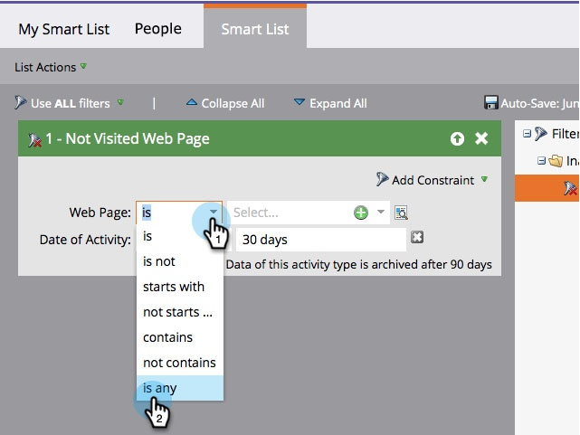

# Inactiviteitsfilters gebruiken in een slimme lijst {#use-inactivity-filters-in-a-smart-list}

Wist u dat u kunt zoeken naar personen in een slimme lijst die _niet_ iets doen? Bekijk deze inactiviteitsfilters.

1. Ga naar **[!UICONTROL Marketing Activities]**.

   

1. Selecteer de slimme lijst die u wilt bewerken en klik op de knop **[!UICONTROL Smart List]** tab.

   

1. Zoek en sleep het inactiviteitsfilter van uw keuze naar het canvas. Laten we bijvoorbeeld zoeken naar mensen die geen van uw pagina&#39;s hebben bezocht.

   

   >[!TIP]
   >
   >Er zijn veel filters in de **[!UICONTROL Inactivity Filters]** map. Zoek naar &quot;Niet&quot;en controleer hen.

1. Selecteer de **[!UICONTROL is any]** operator. Alle mensen die de afgelopen 30 dagen geen enkele pagina hebben bezocht, zullen hier worden gevonden.

   
