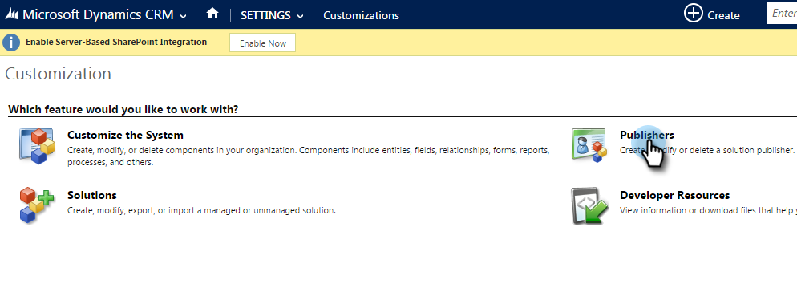

# Een standaardvoorvoegsel voor een aangepast veld instellen {#set-a-default-custom-field-prefix}

Het standaardvoorvoegsel voor Microsoft Dynamics voor aangepaste velden moet zijn ingesteld op _new_ in Marketo-velden correct te synchroniseren. Hier is hoe te om het standaardvoorvoegsel te veranderen.

1. Ga naar Instellingen en selecteer **Aanpassingen**.

   

1. Klikken **Uitgevers**.

   

1. Selecteer de standaarduitgever in de lijst.

   

1. Het voorvoegsel wijzigen in **new**. Klikken **Opslaan en sluiten**.

   

1. Ga naar Instellingen > Oplossingen om de aanpassingen te publiceren.

   

1. Klikken **Alle aanpassingen publiceren**.

   

1. Maak nu aangepaste velden. Nadat u deze hebt voltooid, keert u het voorvoegsel terug naar het oorspronkelijke voorvoegsel.
