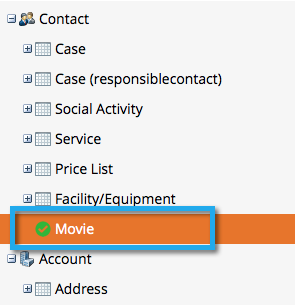

# Sync inschakelen voor een aangepaste entiteit {#enable-sync-for-a-custom-entity}

Als u de gegevens van de douaneentiteit van Dynamica in Marketo Engage beschikbaar moet zijn, is hier hoe te om de synchronisatie voor het toe te laten.

>[!NOTE]
>
>**Vereiste Bevoegdheden Admin**

>[!NOTE]
>
>* Wanneer u de synchronisatie inschakelt voor een aangepaste entiteit, voert Marketo een eerste synchronisatie uit om alle gegevens voor het aangepaste object in te voeren.
>* De leden van de Lijst van de marketing en van de Marketing Lijst worden _niet gesteund_ op dit ogenblik.

>[!IMPORTANT]
>
>De Marketo Sync-gebruiker heeft leestoegang nodig tot het aangepaste object om het object weer te geven en te synchroniseren.

1. Ga naar de sectie **[!UICONTROL Admin]** .

   

1. Selecteer **[!UICONTROL Microsoft Dynamics]** en klik op **[!UICONTROL Disable Sync]** .

   

   >[!NOTE]
   >
   >U moet de algemene synchronisatie tijdelijk uitschakelen om een aangepaste entiteit in of uit te schakelen.

1. Klik onder Databasebeheer op **[!UICONTROL Dynamics Entities Sync]** .

   

1. Klik op **[!UICONTROL Sync schema]**.

   

1. Selecteer de entiteit die u wilt synchroniseren en klik op **[!UICONTROL Enable Sync]** .

   

1. Selecteer de gebieden u als [ beperkingen ](/help/marketo/product-docs/core-marketo-concepts/smart-lists-and-static-lists/using-smart-lists/add-a-constraint-to-a-smart-list-filter.md) en/of trekkers (voor toegevoegde verslagen, _niet_ bijgewerkt) in Slimme Lijsten wilt synchroniseren of gebruiken. Klik op **[!UICONTROL Enable Sync]** als u klaar bent.

   

   >[!NOTE]
   >
   >Tijdens het synchronisatieproces, kunt u opmerken dat het &quot;[!UICONTROL Dynamic Entities Sync]&quot;punt uit de navigatieboom verdwijnt. Dit wordt verwacht en verschijnt weer nadat het synchroniseren is voltooid.

1. De entiteit heeft nu een groen vinkje.

   

1. Vergeet niet de globale synchronisatie opnieuw in te schakelen!

   

   >[!NOTE]
   >
   >* Marketo ondersteunt alleen aangepaste entiteiten die een of twee niveaus diep zijn gekoppeld aan standaardentiteiten.
   >
   >* In de aangepaste objectstructuur kan hetzelfde object meer dan één keer worden weergegeven, vanwege de directe verbindingen met een van de belangrijkste objecten (bijvoorbeeld leads, contactpersonen of accounts of indirecte verbindingen via een intermediair object). In dergelijke gevallen kiest u het object dat zich het dichtst bij het hoofdobject bevindt en slechts één object. Het meerdere keren selecteren van hetzelfde object kan de synchronisatie van dat aangepaste object belemmeren.
