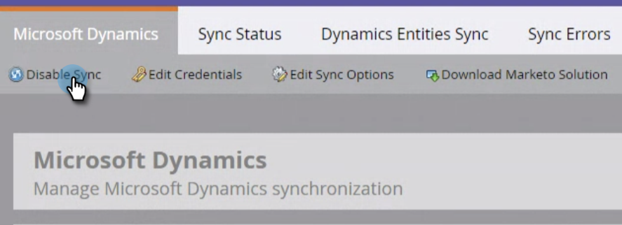

# Te synchroniseren velden bewerken voordat deze worden verwijderd in [!DNL Dynamics] {#editing-fields-to-sync-before-deleting-them-in-dynamics}

Het kan voorkomen dat u velden wilt verwijderen in [!DNL Dynamics] . Marketo houdt de veldlijst bij als een referentie waarop de synchronisatie wordt gebaseerd. Als een veld in [!DNL Dynamics] wordt verwijderd terwijl de synchronisatie is ingeschakeld, kunnen er fouten optreden bij de synchronisatie. Volg de onderstaande stappen voordat u velden verwijdert.

1. Klik in Marketo op **[!UICONTROL Admin]** .

   

1. Klik onder [!UICONTROL Integration] op **[!UICONTROL Microsoft Dynamics]** .

   

1. Klik op **[!UICONTROL Disable Sync]**.

   

1. Meld u aan bij [!DNL Dynamics] op een nieuw tabblad in uw browser en verwijder de gewenste velden.

1. Klik in Marketo onder [!DNL Microsoft Dynamics] nogmaals op **[!UICONTROL Edit]** naast &quot;[!UICONTROL Step 2: Select Fields to Sync]&quot;.

   

1. Controleer de velden en klik op **[!UICONTROL Save]** .

   

>[!CAUTION]
>
>Als u op **[!UICONTROL Save]** klikt, wordt het bijgewerkte schema voor de synchronisatie opgeslagen, zelfs als er geen wijzigingen zijn aangebracht.

>[!NOTE]
>
>Als de synchronisatie niet wordt gestopt voordat een veld in [!DNL Dynamics] wordt verwijderd, kunnen er fouten optreden bij de synchronisatie. Als dit het geval is, wordt de synchronisatie gestopt. Alvorens te hervatten, zou de Admin van Marketo &quot; [!UICONTROL Select Fields to Sync]&quot;(hierboven besproken) moeten herzien en **[!UICONTROL Save]** klikken om de schemaveranderingen goed te keuren.

Vergeet niet de synchronisatie in te schakelen nadat de wijzigingen zijn opgeslagen.
