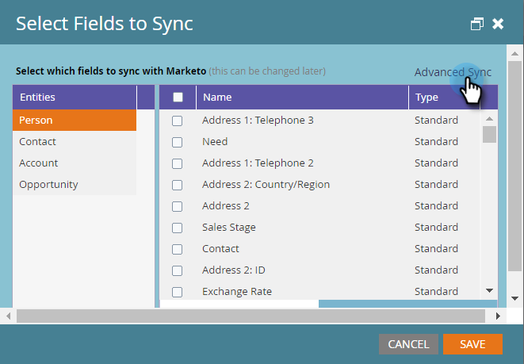

# Snelle synchronisatie gebruiken met [!DNL Microsoft Dynamics] voor een nieuw aangepast veld {#use-quick-sync-with-microsoft-dynamics-for-a-new-custom-field}

Marketing of verkoop wil een nieuw veld. Of misschien bent u er één vergeten in de eerste veldselectie. Of uw behoeften zijn gewijzigd. In elk geval kunt u met Snel synchroniseren specifieke velden opnieuw synchroniseren.

Normaal, zult u Snelle Synchronisatie gebruiken om een nieuw gebied toe te voegen en waarden hebben verfrist. Er zijn echter gevallen waarin u een bestaand veld wilt synchroniseren. U kunt de veldsynchronisatie beperken op basis van een bijgewerkt of gemaakt datumbereik. Zie [ Geavanceerde Opties van de Synchronisatie ](#Advanced_Sync_Options) hieronder voor details.

Met Snelle synchronisatie kunt u null-waarden synchroniseren. Als u bijvoorbeeld de waarden A en B gebruikt en een B-waarde in [!DNL Dynamics] wijzigt in null, wordt de null-waarde gesynchroniseerd met Marketo.

## Snelle synchronisatie voor alle records {#quick-sync-for-all-records}

Hieronder wordt beschreven hoe u Snelle synchronisatie gebruikt om te resynchroniseren voor nieuwe velden.

1. Klik in Marketo op **[!UICONTROL Admin]** .

   

1. Klik op **[!UICONTROL Microsoft Dynamics]**.

   

1. Klik op [!UICONTROL Field Sync Details] op **[!UICONTROL Edit]** .

   

1. Selecteer de velden die u snel wilt synchroniseren en klik op **[!UICONTROL Save]** .

   

   >[!NOTE]
   >
   >U kunt velden selecteren uit meerdere entiteiten.

1. U ontvangt een melding wanneer de synchronisatie is voltooid.

   

   >[!CAUTION]
   >
   >De synchronisatie wordt naast elkaar uitgevoerd met andere syncs, en afhankelijk van de grootte van het gegevensbestand, kan lange tijd vergen om te voltooien. Als een veld zich in een wachtrij bevindt voor synchronisatie, kunt u de selectie ervan niet opheffen.

## Geavanceerde synchronisatieopties {#advanced-sync-options}

Wat gebeurt er als u een bestaand veld wilt synchroniseren, maar dit alleen wilt doen voor een beperkte set gegevens? Zo gaat het.

1. Schakel het selectievakje voor een bestaand veld uit. Klik op **[!UICONTROL Save]**.

   

1. Open de pop-up opnieuw en selecteer het gebied opnieuw.

   

1. Klik op **[!UICONTROL Advanced Sync]**.

   

1. Kies **[!UICONTROL Updated]** en selecteer een datumbereik met de datumkiezers. Klik op **[!UICONTROL Save]**.

   

   Alleen records die tussen 19-8-16 en 19-9-16 zijn bijgewerkt, worden snel gesynchroniseerd voor het veld.

## Niet-gesynchroniseerde velden corrigeren {#fixing-out-of-sync-fields}

In het zeldzame geval dat een [!DNL Dynamics] - en Marketo-veld niet meer synchroon zijn, is er een snelle en eenvoudige manier om ze opnieuw te synchroniseren.

1. Hef de selectie van het veld op en klik op **[!UICONTROL Save]** .

   

1. Selecteer het veld opnieuw en klik op **[!UICONTROL Save]** .

   

   Dat zou het moeten oplossen!
