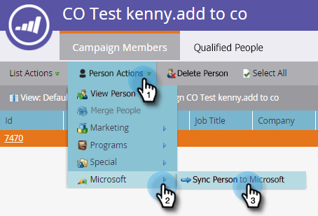

# Een contactpersoon maken in [!DNL Microsoft Dynamics] {#create-a-contact-in-microsoft-dynamics}

1. Selecteer de Marketo Engage-enige persoon (Microsoft Type is leeg) die u als contact in Dynamiek wilt tot stand brengen.

   

1. Klik op **[!UICONTROL Person Actions]** en **[!DNL Microsoft]** en selecteer **[!UICONTROL Sync Person to Microsoft]** .

   

1. Klik op **[!UICONTROL Sync As]** en selecteer **[!UICONTROL Contact]** . Klik op **[!UICONTROL Run Now]**.

   

   >[!NOTE]
   >
   >Wanneer het gebruiken van &quot;[!UICONTROL Sync Person to Microsoft]&quot;stroomactie (in een Campagne van de Trekker slechts), zal het lood/het contact in real time in Dynamiek worden gecreeerd.

1. Marketo kwalificeert die lead-record in [!DNL Dynamics] in een contactpersoon die niet aan een account in [!DNL Dynamics] is gekoppeld.

   

1. U kunt nu **[!UICONTROL Contact]** selecteren wanneer u de beperking Synchroniseren als gebruikt in een slim campagnecilter.

   
