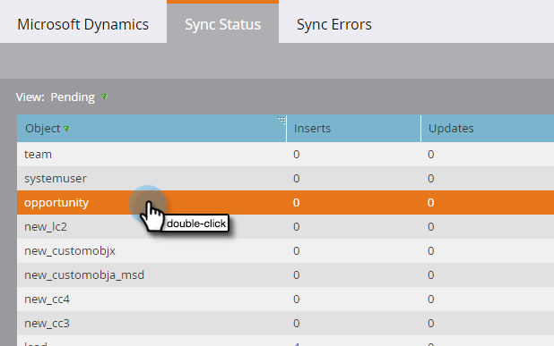

# Synchronisatiestatus {#sync-status}

U kunt tabs op de tabbladen [!UICONTROL Sync Status] en [!UICONTROL Sync Errors] houden bij de huidige doorvoer en achterstand van het synchronisatieproces.

## [!UICONTROL Sync Status] Tab {#sync-status-tab}

1. Klik op **[!UICONTROL Admin]** en **[!UICONTROL Microsoft Dynamics]** .

   

1. Klik op de tab **[!UICONTROL Sync Status]** .

   

   In deze tabel wordt voor elk object een overzicht weergegeven van de ingevoegde en bijgewerkte gegevens die nog niet zijn gesynchroniseerd.

1. Dubbelklik op een rij om de opportuniteitsgegevens weer te geven.

   

   De statusdetails van de synchronisatie worden uitgesplitst naar tussenvoegsels en updates, en oudste opname- en updaterecords.

   

1. Klik op de vervolgkeuzelijst **[!UICONTROL View]** en selecteer **[!UICONTROL Last Hour]** om de doorvoergegevens weer te geven.

   

   In de weergave wordt nu het aantal records weergegeven dat in het laatste volledige uur is gesynchroniseerd (bijvoorbeeld 1-2 uur &#39;s middags).

   

   >[!NOTE]
   >
   >Wanneer u de [!UICONTROL Last Hour] mening bekijkt, tonen de [!UICONTROL Inserts] en [!UICONTROL Updates] kolommen n.v.t. Dit wordt verwacht.

## [!UICONTROL Sync Errors] Tab {#sync-errors-tab}

Blader, zoek of exporteer leads (en andere objecten) die niet konden worden gesynchroniseerd met details zoals bewerking, richting, foutcode en foutbericht.

>[!MORELIKETHIS]
>
>[ Types van Bericht ](/help/marketo/product-docs/core-marketo-concepts/miscellaneous/understanding-notifications/notification-types.md){target="_blank"}
