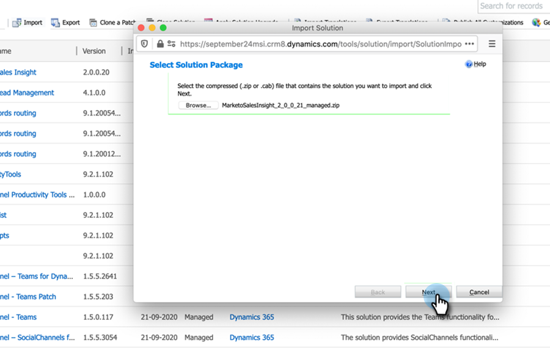

# Plug-inreleases voor [!DNL Microsoft Dynamics] MSI {#plug-in-releases-for-microsoft-dynamics-msi}

Wanneer u voor het eerst synchroniseert met [!DNL Microsoft Dynamics] , downloadt en installeert u de nieuwste versie van de plug-ins voor Marketo Sales Insight (MSI). Deze plug-ins worden regelmatig door Marketo bijgewerkt, zodat u naar dezelfde locatie kunt terugkeren om de nieuwe versie te downloaden.

Als u de inheemse synchronisatieoplossing van CRM van Marketo aan [!DNL Dynamics] gebruikt, gelieve [ de recentste elektrisch toestel ](/help/marketo/product-docs/marketo-sales-insight/msi-for-microsoft-dynamics/installing/download-the-marketo-sales-insight-solution-for-microsoft-dynamics.md){target="_blank"} die aan uw [!DNL Dynamics] versie beantwoorden te downloaden. Voor degenen die een douanesync hebben en de Verkoop Insight van Marketo hebben gekocht, is het [ pakket hier ](https://mktg-cdn.marketo.com/community/MarketoSalesInsight_NonNative.zip){target="_blank"}.

>[!NOTE]
>
>Deze versies werken voor zowel on-premise als online versies van [!DNL Dynamics].

## Een upgrade uitvoeren van uw MSI-oplossing {#upgrading-your-msi-solution}

1. Importeer de recentste versie van de oplossing _over de bestaande versie_ van uw [!DNL Dynamics] CRM door de **[!UICONTROL Import]** knoop in [!DNL Dynamics] te drukken.

   

>[!NOTE]
>
>Voorbeeld: als uw [!DNL Dynamics] CRM versie 2.0.0.20 heeft en de recentste versie 2.0.0.21 is, zou u _over_ versie 2.0.0.20 invoeren.

1. Klik op **[!UICONTROL Next]**.

   

1. Selecteer **[!UICONTROL Stage for Upgrade]** en **[!UICONTROL Maintain customizations]** en klik op **[!UICONTROL Import]** .

   

1. Klik op **[!UICONTROL Next]**.

   

1. Na een succesvolle invoer zult u twee oplossingen MSI zien: MarketoSalesInsight en MarketoSalesInsight_Upgrade. Selecteer de oudere oplossing en klik op Upgrade van oplossing toepassen.

   

En dat is het! Na de verbetering zult u slechts één Oplossing MSI zien.

## Versie-updates {#version-updates}

<table> 
 <tbody> 
  <tr> 
   <th>Releasedatum</th> 
   <th>Versie</th> 
   <th>Notities</th> 
  </tr>
  <tr> 
   <td>14-02-24</td> 
   <td>2 00,31</td> 
   <td>Wijzigingen in paginering op anonieme webactiviteit.
   

   Gegevens van de beveiligingssleutel worden gecodeerd uit de weergave van de gebruiker. Het wachtwoord moet na het importeren van het nieuwe pakket worden gewijzigd voordat codering plaatsvindt.</td> 
  </tr>
  <tr> 
   <td>18-10-23</td> 
   <td>2 00,30</td> 
   <td>Het consolideren van MSI-foutenlogboek en het verwijderen van Info-meldingen uit het weergeven op de Marketo-foutentiteit.</td> 
  </tr>
  <tr> 
   <td>19-05-23</td> 
   <td>2 00,29</td> 
   <td>Oplossing voor problemen met de paginering van webactiviteiten en interessante momenten op het algemene dashboard.</td> 
  </tr>
  <tr> 
   <td>23-03-23</td> 
   <td>2 00,28</td> 
   <td>Creeerde a <a href="https://mktg-cdn.marketo.com/community/MarketoSalesInsight_NonNative.zip"> nieuw pakket </a> voor MSI voor niet inheemse verbindingen aan CRM.</td> 
  </tr>
  <tr> 
   <td>03-02-22</td> 
   <td>2.0.0.27.</td> 
   <td>Accountindeling voor inzichten: interessante momenten, Score-wijzigingen, webactiviteiten, e-mailactiviteiten.</td> 
  </tr>
  <tr> 
   <td>05-01-22</td> 
   <td>2.0.0.26</td> 
   <td>Programmaadoptiescore voor verzenden via e-mail.</td> 
  </tr>
  <tr> 
   <td>28-10-21</td> 
   <td>2.0.0.25.</td> 
   <td>Metriek van de Score van de Aanneming van het product, nieuw Globaal dashboard (de Activiteit van het Web, E-mail, Beste Bets).</td> 
  </tr>
  <tr> 
   <td>10-02-21</td> 
   <td>2.0.0.22</td> 
   <td>Verwijder Auto controle toegelaten en documentatieveranderingen op oplossing MSI.</td> 
  </tr>
  <tr> 
   <td>01-10-20</td> 
   <td>2.0.0.21</td> 
   <td>Bug Fix: Toewijzend toegang tot MSI API configuratiegebieden voor gebruikers met de rol van Insight van de Verkoop.</td> 
  </tr> 
  <tr> 
   <td>20-07-20</td> 
   <td>2.0.0.20</td> 
   <td>Opgeloste fout: voeg een validatiebericht toe voor niet-gesynchroniseerde records.</td> 
  </tr> 
  <tr> 
   <td>12-06-20</td> 
   <td>2.0.0.19.</td> 
   <td>Opgeloste problemen: MSI-wachtwoord verbergen in MSD API Config.</td> 
  </tr> 
  <tr> 
   <td>26-05-20</td> 
   <td>2.0.0.18</td> 
   <td>Foutopsporing: U wijzigt de validatie van de MSI-rol-id voor de weergave van MSI-knoppen.</td> 
  </tr> 
  <tr> 
   <td>21-05-20</td> 
   <td>2.0.0.17</td> 
   <td>Foutopsporing: het veld Eigenaar verbergen opheffen en velden niet-verplicht maken.</td> 
  </tr> 
  <tr> 
   <td>28-04-20</td> 
   <td>2.0.0.16</td> 
   <td>Opgeloste problemen: MSD CRM sitemap-instelling voor koppelingsafhankelijkheid verwijderen.</td> 
  </tr> 
 </tbody> 
</table>
