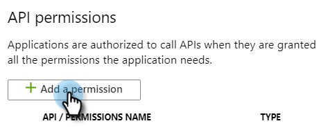
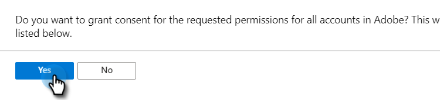

# Registreer een app bij Azure om uw client-id/app-id op te halen {#register-an-app-with-azure-to-acquire-your-client-id-app-id}

Azure Active Directory breidt uw mappen op locatie uit naar de cloud en biedt ondersteuning voor [!DNL MS Dynamics 365] CRM met ADFS-verificatie op locatie.

## Een nieuwe app registreren {#registering-a-new-app}

1. [ Login ](https://login.microsoftonline.com/){target="_blank"} aan het Microsoft Azure beheersportaal gebruikend een rekening met admintoestemmingen. U kunt het Microsoft Azure-portaal ook openen via Office 365 Admin Center door het item **[!UICONTROL Admin]** uit te vouwen in het linkernavigatievenster en **[!UICONTROL Azure AD]** te selecteren.

   >[!CAUTION]
   >
   >U moet een account gebruiken in hetzelfde [!DNL Office 365] -abonnement als het account waarmee u de app wilt registreren.

   >[!NOTE]
   >
   >Als u geen Azure rekening hebt, kunt u [ omhoog ](https://azure.microsoft.com/en-us/free/){target="_blank"} voor ondertekenen. Raadpleeg de documentatie bij Microsoft of neem contact op met uw Microsoft-vertegenwoordiger voor meer informatie. Nadat u een Azure-account hebt gemaakt, kunt u een of meer apps registreren aan de hand van de onderstaande procedure.
   >
   >
   >Als u een Azure rekening maar uw [!DNL Office 365] abonnement met [!DNL Microsoft Dynamics 365] niet beschikbaar in uw Azure abonnement hebt, volg [ deze instructies ](https://msdn.microsoft.com/office/office365/howto/setup-development-environment#bk_CreateAzureSubscription){target="_blank"} om de twee rekeningen te associëren.

1. Zoek en klik op **[!UICONTROL Azure Active Directory]** in het navigatievenster aan de linkerkant.

   

1. Klik onder [!UICONTROL Manage] op **[!UICONTROL App registrations]** .

   

1. Klik op **[!UICONTROL New registration]** boven aan de pagina.

   

1. Voer een naam voor uw app in, kies het accounttype dat u wilt gebruiken en voer een omleidings-URL in. Klik vervolgens op **[!UICONTROL Register]** onder aan de pagina.

   

1. De app wordt nu weergegeven op het tabblad **[!UICONTROL App registrations]** .

   

## Toepassingsmachtigingen configureren {#configuring-app-permissions}

1. Klik onder het tabblad **[!UICONTROL App registrations]** in de Active Directory op de toepassing waarvoor u machtigingen wilt configureren.

   

1. Klik onder [!UICONTROL Manage] op **[!UICONTROL API permissions]** .

   

1. Klik op **[!UICONTROL Add a permission]** .

   

1. Kies **[!UICONTROL Dynamics CRM]** .

   

1. Controleer **[!UICONTROL Access Common Data Service as organization users]** doos, dan klik **[!UICONTROL Add permissions].**

   

1. Zodra de toestemmingen met succes zijn toegevoegd, wacht minstens 10 seconden.

   

1. Klik op **[!UICONTROL Grant admin consent]** .

   

1. Klik op **[!UICONTROL Yes]** om te bevestigen.

   

   En je bent klaar!

   
