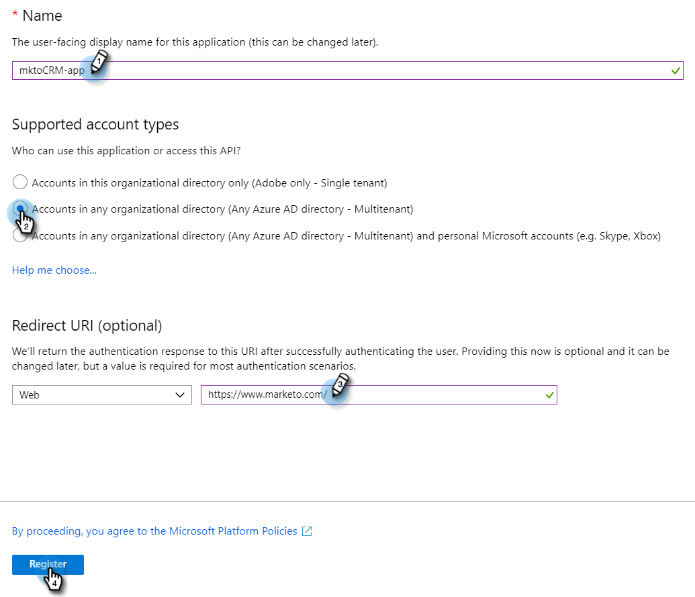

# Registreer een app bij Azure om uw client-id/app-id op te halen {#register-an-app-with-azure-to-acquire-your-client-id-app-id}

Azure Active Directory breidt uw directories op locatie uit naar de cloud en biedt ondersteuning voor MS Dynamics 365 CRM met ADFS-verificatie op locatie.

## Een nieuwe app registreren {#registering-a-new-app}

1. [Aanmelden](https://login.microsoftonline.com/){target=&quot;_blank&quot;} naar de Microsoft Azure-beheerportal met een account met beheerdersrechten. U kunt het Microsoft Azure-portaal ook openen via het Office 365 Admin Center door de **Beheer** item in het linkernavigatievenster en selecteren **Azure AD**.

   >[!CAUTION]
   >
   >U moet een account gebruiken in hetzelfde Office 365-abonnement als de account waarmee u de app wilt registreren.

   >[!NOTE]
   >
   >Als u geen Azure-account hebt, kunt u [aanmelden](https://azure.microsoft.com/en-us/free/){target=&quot;_blank&quot;} voor één. Raadpleeg de documentatie bij Microsoft of neem contact op met uw Microsoft-vertegenwoordiger voor meer informatie. Nadat u een Azure-account hebt gemaakt, kunt u een of meer apps registreren aan de hand van de onderstaande procedure.
   >
   >
   >Als u een Azure-account hebt maar uw Office 365-abonnement met Microsoft Dynamics 365 niet beschikbaar is in uw Azure-abonnement, volgt u [deze instructies](https://msdn.microsoft.com/office/office365/howto/setup-development-environment#bk_CreateAzureSubscription){target=&quot;_blank&quot;} om de twee accounts te koppelen.

1. Zoeken en klikken **Azure Active Directory** in het linkernavigatievenster.

   

1. Klik onder Beheren op **Toepassingsregistraties**.

   

1. Klikken **Nieuwe registratie** boven aan de pagina.

   

1. Voer een naam voor uw app in, kies het accounttype dat u wilt gebruiken en voer een omleidings-URL in. Klik vervolgens op **Registreren** onder aan de pagina.

   

1. U moet nu uw app in de **Toepassingsregistraties** tab.

   

## Toepassingsmachtigingen configureren {#configuring-app-permissions}

1. Onder de **Toepassingsregistraties** in uw Actieve Folder, klik app u toestemmingen voor wilt vormen.

   

1. Klik onder Beheren op **API-machtigingen**.

   

1. Klik op de knop **Een machtiging toevoegen** knop.

   

1. Kies **Dynamics CRM**.

   

1. Controleer de **Toegang tot Gemeenschappelijke Gegevensdienst als organisatiegebruiker***s** en klik vervolgens op **Machtigingen toevoegen.**

   

1. Zodra de toestemmingen met succes zijn toegevoegd, wacht minstens 10 seconden.

   

1. Klik op de knop **Toelating beheerder** knop.

   

1. Klikken **Ja** ter bevestiging.

   

   En je bent klaar!

   
