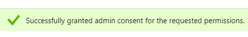

# Registreer een app bij Azure om uw client-id/app-id {#register-an-app-with-azure-to-acquire-your-client-id-app-id} te verkrijgen

Azure Active Directory breidt uw directories op locatie uit naar de cloud en biedt ondersteuning voor MS Dynamics 365 CRM met ADFS-verificatie op locatie.

## Een nieuwe app {#registering-a-new-app} registreren

1. [Meld u ](https://manage.windowsazure.com/) aan bij de Microsoft Azure-beheerportal met een account met beheerdersrechten. U kunt tot het portaal van Microsoft Azure ook toegang hebben door Office 365 Admin Center door **Admin** punt in de linkernavigatieruit uit te breiden en **Azure AD** te selecteren.

   >[!CAUTION]
   >
   >U moet een account gebruiken in hetzelfde Office 365-abonnement als de account waarmee u de app wilt registreren.

   >[!NOTE]
   >
   >Als u geen Azure-account hebt, kunt u [zich ](https://azure.microsoft.com/en-us/free/) voor één account aanmelden. Raadpleeg de documentatie van Microsoft of neem contact op met uw vertegenwoordiger van Microsoft voor meer informatie. Nadat u een Azure-account hebt gemaakt, kunt u een of meer apps registreren aan de hand van de onderstaande procedure.
   >
   >
   >Als u een Azure-account hebt maar uw Office 365-abonnement met Microsoft Dynamics 365 niet beschikbaar is in uw Azure-abonnement, volgt u [deze instructies](https://msdn.microsoft.com/office/office365/howto/setup-development-environment#bk_CreateAzureSubscription) om de twee accounts te koppelen.

1. Zoek en klik **Azure Active Directory** in het linkernavigatievenster.

   

1. Klik onder Beheren op **Toepassingsregistraties**.

   

1. Klik **Nieuwe registratie** bij de bovenkant van de pagina.

   

1. Voer een naam voor uw app in, kies het accounttype dat u wilt gebruiken en voer een omleidings-URL in. Klik vervolgens op **Registreren** onder aan de pagina.

   

1. De toepassing wordt nu weergegeven op het tabblad **Toepassingsregistraties**.

   

## Toepassingsmachtigingen {#configuring-app-permissions} configureren

1. Klik onder **App-registraties** tabblad in uw Active Directory op de toepassing waarvoor u machtigingen wilt configureren.

   

1. Klik onder Beheren op **API-machtigingen**.

   

1. Klik op de knop **Een machtiging toevoegen**.

   

1. Kies **Dynamische CRM**.

   

1. Schakel het selectievakje **Algemene gegevensservice openen als organisatiegebruiker***s** in en klik op **Machtigingen toevoegen.**

   

1. Zodra de toestemmingen met succes zijn toegevoegd, wacht minstens 10 seconden.

   

1. Klik op de knop **Goedkeuring van beheerder toewijzen**.

   

1. Klik **Ja** om te bevestigen.

   

   En je bent klaar!

   
