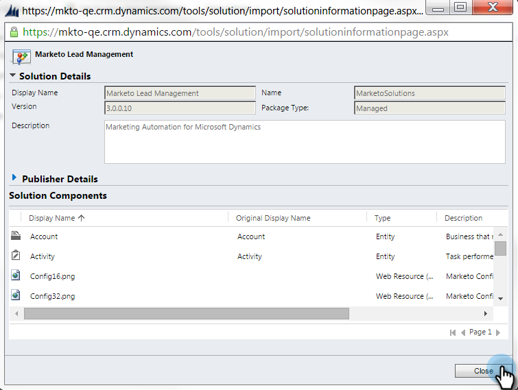

# Stap 1 van 3: De Marketo-oplossing installeren (2011 op locatie) {#step-of-install-the-marketo-solution-on-premises}

Voordat u Microsoft Dynamics On-Premises en Marketo kunt synchroniseren, moet u eerst de Marketo-oplossing installeren in Dynamics.

>[!NOTE]
>
>Nadat u Marketo synchroniseert met een CRM, kunt u geen nieuwe synchronisatie uitvoeren zonder de instantie te vervangen.

>[!PREREQUISITES]
>
>U moet [Implementatie van internetbestanden](https://www.microsoft.com/en-us/download/confirmation.aspx?id=41701) (IFD) met [Active Directory Federation Services](https://msdn.microsoft.com/en-us/library/bb897402.aspx) 2.0, 2.1 of 3.0 (ADFS) geconfigureerd. **Opmerking**: Het IFD-document wordt automatisch gedownload wanneer u op de koppeling klikt.
>
>[Download de Marketo Lead Management Solution](/help/marketo/product-docs/crm-sync/microsoft-dynamics-sync/sync-setup/download-the-marketo-lead-management-solution.md) voordat u begint.

>[!NOTE]
>
>**Beheerdersrechten voor dynamiek vereist.**
>
>U hebt CRM-beheerdersrechten nodig om deze synchronisatie uit te voeren.

1. Aanmelden bij **Dynamiek**, selecteert u **Instellingen** in het menu linksonder.

   

1. Selecteren **Oplossingen** in de boom.

   

1. Klikken **Importeren**.

   

1. Klikken **Bladeren**. Selecteer de Marketo Lead Management-oplossing die u wilt [gedownload](/help/marketo/product-docs/crm-sync/microsoft-dynamics-sync/sync-setup/download-the-marketo-lead-management-solution.md). Klikken **Volgende**.

   

1. Bekijk de Informatie van de Oplossing en klik **Details van oplossingspakket weergeven**.

   

1. Wanneer u alle details hebt gecontroleerd, klikt u op **Sluiten**.

   

1. Terug op de pagina van de Informatie van de Oplossing, klik **Volgende**.

   

1. Controleer of het selectievakje voor de optie voor SDK-berichten is ingeschakeld. Klikken **Volgende**.

   

   >[!TIP]
   >
   >U moet pop-ups in uw browser inschakelen om het installatieproces te voltooien.

1. Wacht nu tot het importeren is voltooid. Opstaan en wat stretches uitvoeren.

   

1. Klikken **Sluiten**.

   >[!NOTE]
   >
   >Je ziet mogelijk een bericht met de melding &quot;Marketo Lead Management completed with warning&quot; (Beheer van leads is voltooid met een waarschuwing). Dat wordt volledig verwacht.

   

1. Marketo Lead Management wordt nu weergegeven op het tabblad **Alle oplossingen** pagina.

   

1. Selecteer Marketo Lead Management en klik op **Alle aanpassingen publiceren.**

   

Was het niet zo erg? Kom op, ik zal je door de rest blijven lopen.

>[!CAUTION]
>
>Als u een van de Marketo SDK Messaging Processes uitschakelt, wordt de installatie verbroken!

>[!MORELIKETHIS]
>
>[Stap 2 van 3: Marketo Sync User in Dynamics instellen (2011 op locatie)](/help/marketo/product-docs/crm-sync/microsoft-dynamics-sync/sync-setup/connecting-to-legacy-versions/step-2-of-3-set-up.md)
