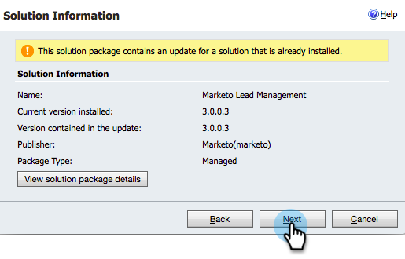
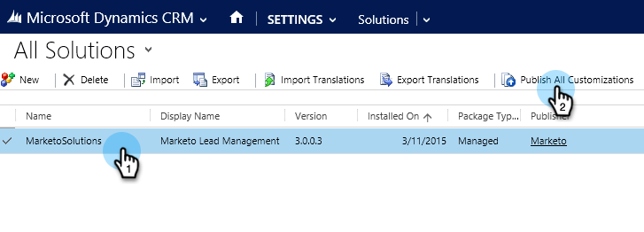

# Stap 1 van 3: Sync User for Marketo configureren (2015 op voorgrond) {#step-of-configure-sync-user-for-marketo-on-premises-2015}

Voordat u Microsoft Dynamics 2015 On-Premises kunt synchroniseren met Marketo Engage, moet u eerst de Marketo-oplossing installeren in Dynamics.

>[!NOTE]
>
>Nadat u Marketo synchroniseert met een CRM, kunt u geen nieuwe CRM synchroniseren met de bestaande Marketo-instantie.

>[!PREREQUISITES]
>
>Als u Microsoft Dynamics On-Premise gebruikt, moet u [ Internet Facing Plaatsing ](https://learn.microsoft.com/en-us/dynamics365/customerengagement/on-premises/deploy/configure-an-internet-facing-deployment){target="_blank"} (IFD) met [ de Actieve Diensten van de Federatie van de Folder hebben ](https://msdn.microsoft.com/en-us/library/bb897402.aspx){target="_blank"} 2.0+ (ADFS) gevormd. Opmerking: het IFD-document wordt automatisch gedownload wanneer u op de koppeling klikt.
>
>[ Download de Oplossing van het Beheer van de Lood van Marketo ](/help/marketo/product-docs/crm-sync/microsoft-dynamics-sync/sync-setup/download-the-marketo-lead-management-solution.md){target="_blank"} alvorens u begint.

>[!NOTE]
>
>{de Vereiste toestemmingen van Admin van de Dynamica 0} **.**
>
>U hebt CRM-beheerdersrechten nodig om deze synchronisatie uit te voeren.

1. Meld u aan bij Dynamiek. Klik op de vervolgkeuzelijst **[!UICONTROL Microsoft Dynamics CRM]** en selecteer **[!UICONTROL Settings]** .

   

1. Selecteer onder **[!UICONTROL Settings]** de optie **[!UICONTROL Solutions]** .

   

1. Klik op **[!UICONTROL Import]**.

   

1. Klik **[!UICONTROL Browse]** en selecteer de oplossing u [&#128279;](/help/marketo/product-docs/crm-sync/microsoft-dynamics-sync/sync-setup/download-the-marketo-lead-management-solution.md) downloadde. Klik op **[!UICONTROL Next]**.

   

1. Bekijk de Informatie van de Oplossing en klik **[!UICONTROL View solution package details]**.

   

1. Klik op **[!UICONTROL Close]** als u alle details hebt gecontroleerd.

   

1. Klik op de pagina Oplossingsgegevens op **[!UICONTROL Next]** .

   

1. Controleer of het selectievakje SDK is ingeschakeld. Klik op **[!UICONTROL Import]**.

   

1. Wacht tot het importeren is voltooid.

   >[!TIP]
   >
   >U moet pop-ups in uw browser inschakelen om het installatieproces te voltooien.

   

1. Download een logbestand (als u dat wilt) en klik op **[!UICONTROL Close]** .

   >[!NOTE]
   >
   >Je ziet mogelijk een bericht met de melding &quot;Marketo Lead Management completed with warning&quot; (Beheer van leads is voltooid met een waarschuwing). Dat wordt volledig verwacht.

   

1. Marketo Lead Management wordt nu op de pagina **[!UICONTROL All Solutions]** weergegeven.

   

1. Selecteer de Marketo-oplossing en klik op **[!UICONTROL Publish All Customizations]** .

   

   Mooi werk! De installatie is voltooid.

   >[!CAUTION]
   >
   >Als u een van de Marketo SDK Messaging Processes uitschakelt, wordt de installatie verbroken!

   >[!MORELIKETHIS]
   >
   >[ installeer Marketo voor Microsoft Dynamics 2015 On-Premises Stap 2 van 3 ](/help/marketo/product-docs/crm-sync/microsoft-dynamics-sync/sync-setup/connecting-to-legacy-versions/step-2-of-3-set-up-2015.md){target="_blank"}
