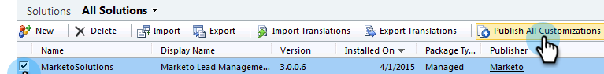

# Stap 2 van 3: Sync User for Marketo configureren (2013 op locatie) {#step-of-configure-sync-user-for-marketo-on-premises}

Als je de vorige stappen hebt uitgevoerd, ga je door.

>[!PREREQUISITES]
>
>[ Stap 1 van 3: Installeer de Oplossing van Marketo in  [!DNL Dynamics]  (2013 On-Premises) ](/help/marketo/product-docs/crm-sync/microsoft-dynamics-sync/sync-setup/connecting-to-legacy-versions/step-1-of-3-install-2013.md)

## Gebruikersrol synchroniseren toewijzen {#assign-sync-user-role}

Wijs de Marketo Sync User rol alleen toe aan de Marketo sync-gebruiker. U hoeft het niet aan andere gebruikers toe te wijzen.

>[!NOTE]
>
>Dit geldt voor Marketo-insteekmodule versie 4.0.0.14 en hoger. Voor eerdere versies moeten alle gebruikers de gebruikersrol synchroniseren hebben. Om Marketo te bevorderen, zie [ Verbetering de Oplossing van Marketo voor  [!DNL Microsoft Dynamics]](/help/marketo/product-docs/crm-sync/microsoft-dynamics-sync/sync-setup/update-the-marketo-solution-for-microsoft-dynamics.md).

>[!IMPORTANT]
>
>Taal het plaatsen van de Gebruiker van de Synchronisatie [ zou aan Engels ](https://learn.microsoft.com/en-us/power-platform/admin/enable-languages){target="_blank"} moeten worden geplaatst.

1. Klik onder **[!UICONTROL Settings]** op **[!UICONTROL Administration]** .

   

1. Selecteer **[!UICONTROL Users]**.

   

1. Hier wordt een lijst met gebruikers weergegeven. Selecteer uw specifieke gebruiker van de Synchronisatie van Marketo of contacteer uw [ Actieve Diensten van de Federatie van de Folder (AFDS) ](https://msdn.microsoft.com/en-us/library/bb897402.aspx){target="_blank"} beheerder om een nieuwe gebruiker te creëren die [ aan Marketo ](https://blogs.technet.com/b/askpfeplat/archive/2014/04/21/introduction-to-active-directory-federation-services-ad-fs-alternateloginid-feature.aspx){target="_blank"} gewijd is.

   

1. Selecteer de synchronisatiegebruiker. Klik op  en selecteer **[!UICONTROL Manage Roles]**

   

1. Controleer **[!UICONTROL Marketo Sync User]** en klik op **[!UICONTROL OK]** .

   

   >[!TIP]
   >
   >Als u niet de rol ziet, ga terug naar [ stap 1 van 3 ](/help/marketo/product-docs/crm-sync/microsoft-dynamics-sync/sync-setup/connecting-to-legacy-versions/step-1-of-3-install-2013.md){target="_blank"} en voer de oplossing in.

   >[!NOTE]
   >
   >Om het even welke updates die in uw CRM door de Gebruiker van de Synchronisatie worden gemaakt zullen _niet_ terug naar Marketo worden gesynchroniseerd.

## Marketo-oplossing configureren {#configure-marketo-solution}

Bijna klaar! We hebben slechts een paar laatste stukken configuratie voordat we naar het volgende artikel gaan.

1. Klik onder **[!UICONTROL Settings]** op **[!UICONTROL Marketo Config]** .

   

   >[!NOTE]
   >
   >Als **[!UICONTROL Marketo Config]** ontbreekt, vernieuw de pagina. Als de kwestie voortduurt, [ publiceer opnieuw de oplossing van Marketo ](/help/marketo/product-docs/crm-sync/microsoft-dynamics-sync/sync-setup/connecting-to-legacy-versions/step-1-of-3-install-2013.md) of probeer het programma openen en terug binnen.

1. Klik op **[!UICONTROL Default]**.

   

1. Klik op het veld **[!UICONTROL Marketo User]** en selecteer de synchronisatiegebruiker.

   

1. Klik op  in de rechterbenedenhoek om de wijzigingen op te slaan.

   

1. Klik op **[!UICONTROL Publish All Customizations]**.

   

## Voordat u verdergaat met stap 3 {#before-proceeding-to-step}

* Als u het aantal verslagen wilt beperken u synchroniseert, [ opstelling een filter van de douanesynchronisatie ](/help/marketo/product-docs/crm-sync/microsoft-dynamics-sync/create-a-custom-dynamics-sync-filter.md) nu.
* Stel [ in werking bevestigt  [!DNL Microsoft Dynamics]  Synchronisatie ](/help/marketo/product-docs/crm-sync/microsoft-dynamics-sync/sync-setup/validate-microsoft-dynamics-sync.md) proces. Hierbij wordt gecontroleerd of de eerste instellingen correct zijn uitgevoerd.
* Meld u aan bij Marketo Sync User in [!DNL Microsoft Dynamics] CRM.

Geweldig werk!

>[!MORELIKETHIS]
>
>[ Stap 3 van 3: Verbind Marketo en  [!DNL Dynamics]  (2013 On-Premises) ](/help/marketo/product-docs/crm-sync/microsoft-dynamics-sync/sync-setup/connecting-to-legacy-versions/step-3-of-3-connect-2013.md)
