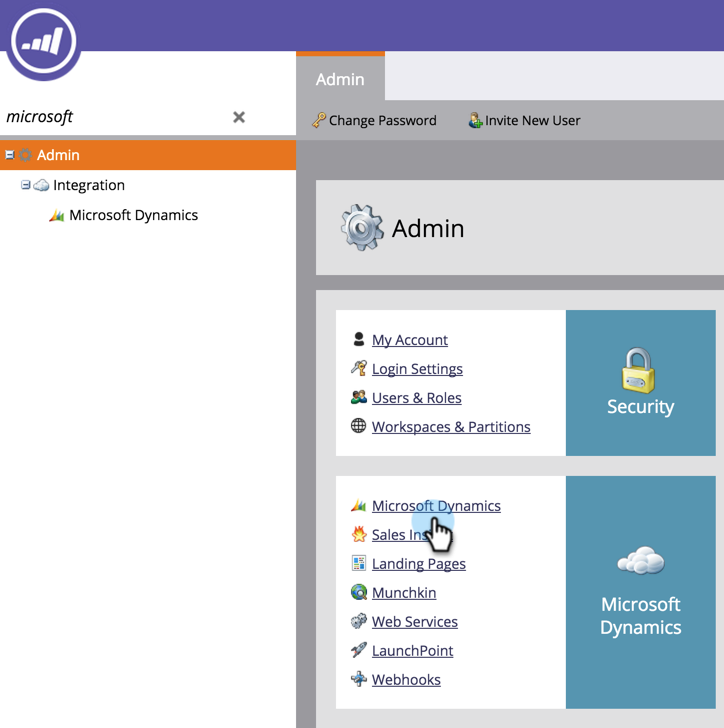

# Upgrade de Marketo-oplossing voor Microsoft Dynamics {#upgrade-the-marketo-solution-for-microsoft-dynamics}

Wanneer een nieuwe oplossing van de Dynamiek van Microsoft wordt vrijgegeven, kunt u de verbetering van het gebied Admin in uw rekening downloaden.

>[!NOTE]
>
>**Beheerdersmachtigingen vereist**

>[!CAUTION]
>
>Het is absoluut noodzakelijk dat u de nieuwste Marketo-oplossing downloadt *voordat* u een upgrade uitvoert.

1. Ga naar het gebied **Admin **.

   

1. Klik op **Microsoft Dynamics**.

   

1. Selecteer Marketo-oplossing **** downloaden.

   

1. Selecteer de aangewezen oplossing voor uw versie van de Dynamica van Microsoft.

   

   Geweldig! Een ZIP-bestand van de oplossing wordt nu naar het apparaat gedownload. Als u niet bekend bent met de installatiestappen, neemt u contact op met uw Dynamics Admin.

