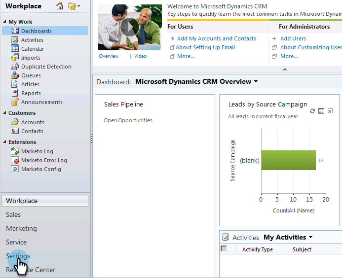

# Stap 1 van 3: De Marketo-oplossing installeren (2011 op locatie) {#step-of-install-the-marketo-solution-on-premises}

Voordat u Microsoft Dynamics On-Premises en Marketo kunt synchroniseren, moet u eerst de oplossing Marketo in Dynamics installeren.

>[!NOTE]
>
>Nadat u Marketo aan CRM synchroniseert, kunt u geen nieuwe synchronisatie uitvoeren zonder de instantie te vervangen.

>[!PREREQUISITES]
>
>U moet [Internet Facing Deployment](https://www.microsoft.com/en-us/download/confirmation.aspx?id=41701) (IFD) hebben met [de Actieve Diensten van de Federatie van de Folder](https://msdn.microsoft.com/en-us/library/bb897402.aspx) 2.0, 2.1 of 3.0 (ADFS) gevormd. **Opmerking**: Het IFD-document wordt automatisch gedownload wanneer u op de koppeling klikt.
>
>[Download de ](/help/marketo/product-docs/crm-sync/microsoft-dynamics-sync/sync-setup/download-the-marketo-lead-management-solution.md) Oplossing van het Beheer van de Lood van het Marketo alvorens u begint.

>[!NOTE]
>
>**Beheerdersrechten voor dynamiek vereist.**
>
>U hebt CRM-beheerdersrechten nodig om deze synchronisatie uit te voeren.

1. Meld u aan bij **Dynamics**, selecteer **Settings** in het linksonder menu.

   

1. Selecteer **Oplossingen** in de boom.

   

1. Klik **Importeren**.

   

1. Klik **Bladeren**. Selecteer de Marketo Lead Management-oplossing die u [hebt gedownload](/help/marketo/product-docs/crm-sync/microsoft-dynamics-sync/sync-setup/download-the-marketo-lead-management-solution.md). Klik **Volgende**.

   

1. Bekijk de Informatie van de Oplossing en klik **de details van het oplossingspakket van de Mening**.

   

1. Wanneer u klaar bent met het controleren van alle details, klik **Close**.

   

1. Terug op de pagina van de Informatie van de Oplossing, klik **Volgende**.

   

1. Controleer of het selectievakje voor de optie voor SDK-berichten is ingeschakeld. Klik **Volgende**.

   

   >[!TIP]
   >
   >U moet pop-ups in uw browser inschakelen om het installatieproces te voltooien.

1. Wacht nu tot het importeren is voltooid. Opstaan en wat stretches uitvoeren.

   

1. Klik **Close**.

   >[!NOTE]
   >
   >Je ziet mogelijk een bericht met de melding &quot;Beheer van leads markeren voltooid met waarschuwing&quot;. Dat wordt volledig verwacht.

   

1. Marketo Lead Management wordt nu weergegeven op de pagina **All Solutions**.

   

1. Selecteer Marketo Lead Management en klik op **Alle aanpassingen publiceren.**

   

Was het niet zo erg? Kom op, ik zal je door de rest blijven lopen.

>[!CAUTION]
>
>Het onbruikbaar maken van om het even welke processen van het Overseinen van SDK van de Marketo zal in gebroken installeren resulteren!

>[!MORELIKETHIS]
>
>[Stap 2 van 3: Marketo Sync User in Dynamics (2011 op locatie) instellen](/help/marketo/product-docs/crm-sync/microsoft-dynamics-sync/sync-setup/microsoft-dynamics-2011-on-premises/step-2-of-3-set-up.md)
