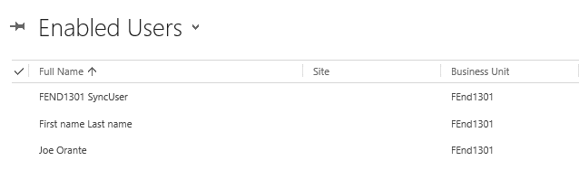
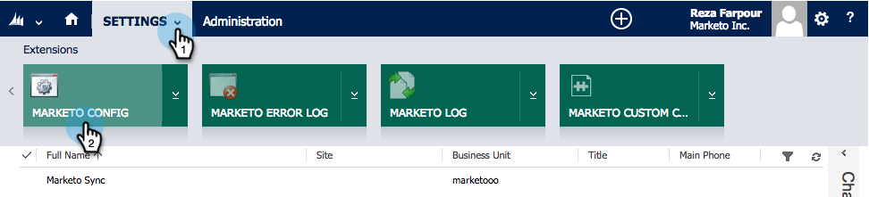

# Stap 2 van 3: Sync User for Marketo configureren (2013 op locatie) {#step-of-configure-sync-user-for-marketo-on-premises}

Als je de vorige stappen hebt uitgevoerd, ga je door.

>[!PREREQUISITES]
>
>* [Stap 1 van 3: De Marketo-oplossing in Dynamics installeren (2013 op locatie)](step-1-of-3-install.md)

## Gebruikersrol synchroniseren toewijzen {#assign-sync-user-role}

Wijs de rol Marketo Sync User alleen toe aan Marketo Sync user. U hoeft het niet aan andere gebruikers toe te wijzen.

>[!NOTE]
>
>Dit geldt voor Marketo-plug-in versie 4.0.0.14 en hoger. Voor eerdere versies moeten alle gebruikers de gebruikersrol synchroniseren hebben. Om Marketo te bevorderen, zie [Verbetering de Oplossing van de Marketo voor de Dynamiek](../../../../../product-docs/crm-sync/microsoft-dynamics-sync/sync-setup/download-the-marketo-lead-management-solution/upgrade-the-marketo-solution-for-microsoft-dynamics.md)van Microsoft.

1. Klik onder **Instellingen** op **Beheer**.

   

1. Selecteer **Gebruikers**.

   

1. Hier wordt een lijst met gebruikers weergegeven. Selecteer uw specifieke Marketo synchroniseert gebruiker of contacteer uw [Actieve](https://msdn.microsoft.com/en-us/library/bb897402.aspx) beheerder van de Federatie van de Folder van de Diensten (AFDS) [om een nieuwe gebruiker tot stand te brengen die aan Marketo gewijd is.](http://blogs.technet.com/b/askpfeplat/archive/2014/04/21/introduction-to-active-directory-federation-services-ad-fs-alternateloginid-feature.aspx)

   

1. Selecteer de synchronisatiegebruiker. Klik en selecteer Rollen **beheren**

   

1. Schakel **Marketo Sync User** in en klik op **OK**.

   

   >[!TIP]
   >
   >Als u de rol niet ziet, ga terug naar [stap 1 van 3](step-1-of-3-install.md) en voer de oplossing in.

   >[!NOTE]
   >
   >Updates die door de synchronisatiegebruiker in uw CRM worden uitgevoerd, worden **niet** weer gesynchroniseerd met Marketo.

## Marketo-oplossing configureren {#configure-marketo-solution}

Bijna klaar! We hebben slechts een paar laatste stukken configuratie voordat we naar het volgende artikel gaan.

1. Klik onder **Instellingen** op **Marketo Config**.

   

   >[!NOTE]
   >
   >Vernieuw de pagina als **Marketo Config** ontbreekt. Als het probleem zich blijft voordoen, [publiceert u de Marketo-oplossing](https://docs.marketo.com/pages/viewpage.action?pageId=3571813#Step1of3:InstalltheMarketoSolutioninDynamics(2013On-Premises)-PublishAllCustomizations) opnieuw of probeert u zich af te melden en weer aan te melden.

1. Klik op **Standaard**.

   

1. Klik op het veld **Marketo-gebruiker** en selecteer de synchronisatiegebruiker.

   

1. Klik  in de bodem juiste hoek om de veranderingen te bewaren.

   

1. Klik op Alle aanpassingen **publiceren**.

   

## Voordat u verdergaat met stap 3 {#before-proceeding-to-step}

* Als u het aantal records dat u synchroniseert wilt beperken, [stelt u nu een aangepast synchronisatiefilter](../../../../../product-docs/crm-sync/microsoft-dynamics-sync/create-a-custom-dynamics-sync-filter.md) in.
* Voer het proces [Validate Microsoft Dynamics Sync](../../../../../product-docs/crm-sync/microsoft-dynamics-sync/sync-setup/validate-microsoft-dynamics-sync.md) uit. Hierbij wordt gecontroleerd of de eerste instellingen correct zijn uitgevoerd.
* Log in de Marketo Sync User in Microsoft Dynamics CRM.

Geweldig werk!

>[!NOTE]
>
>**Verwante artikelen**
>
>* [Stap 3 van 3: Connect Marketo en Dynamics (2013 op locatie)](step-3-of-3-connect.md)

