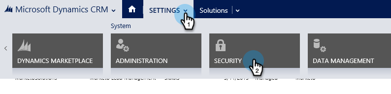

# Stap 2 van 3 Opstelling Marketo for Dynamics (2016 On-Prem/Dynamics 365 On-Premises){#step-of-set-up-for-marketo-on-premises-2016}

Geweldig werk bij het voltooien van de vorige stappen. Laten we hier doorheen gaan.

>[!PREREQUISITES]
>
>[Marketo for Microsoft Dynamics 2016/Dynamics 365 On-Premises Stap 1 van 3 installeren](/help/marketo/product-docs/crm-sync/microsoft-dynamics-sync/sync-setup/microsoft-dynamics-2016-dynamics-365-on-premises/step-1-of-3-install.md)

## Gebruikersrol synchroniseren toewijzen {#assign-sync-user-role}

Wijs de Marketo Sync User rol alleen toe aan de Marketo sync-gebruiker. U hoeft het niet aan andere gebruikers toe te wijzen.

>[!NOTE]
>
>Dit geldt voor Marketo versie 4.0.0.14 en hoger. Voor eerdere versies moeten alle gebruikers de gebruikersrol synchroniseren hebben. Ga voor een upgrade van uw Marketo naar [Upgrade de Marketo-oplossing voor Microsoft Dynamics](/help/marketo/product-docs/crm-sync/microsoft-dynamics-sync/sync-setup/update-the-marketo-solution-for-microsoft-dynamics.md).

>[!IMPORTANT]
>
>De taalinstelling van de synchronisatiegebruiker [moet worden ingesteld op Engels](https://portal.dynamics365support.com/knowledgebase/article/KA-01201/en-us).

1. Onder **Instellingen**, klikt u op **Beveiliging**.

   

1. Klikken **Gebruikers**.

   

1. Hier wordt een lijst met gebruikers weergegeven. Selecteer de toegewezen Marketo Sync-gebruiker of neem contact op met uw [Active Directory Federation Services](https://msdn.microsoft.com/en-us/library/bb897402.aspx)(ADFS)-beheerder om een specifieke gebruiker voor Marketo te maken.

   

1. Selecteer de synchronisatiegebruiker. Klikken **Rollen beheren**.

   

   Controleer Marketo Sync User en klik op OK.

   

   >[!TIP]
   >
   >Als je de rol niet ziet, ga dan terug naar [stap 1 van 3](/help/marketo/product-docs/crm-sync/microsoft-dynamics-sync/sync-setup/microsoft-dynamics-2016-dynamics-365-on-premises/step-1-of-3-install.md) en importeer de oplossing.

   >[!NOTE]
   >
   >Alle updates die door de synchronisatiegebruiker in uw CRM worden aangebracht, worden **niet** worden gesynchroniseerd naar Marketo.

## Marketo-oplossing configureren {#configure-marketo-solution}

Bijna klaar! We hebben slechts een paar laatste stukken configuratie voordat we naar het volgende artikel gaan.

1. Onder **Instellingen**, klikt u op **Marketo Config**.

   

   >[!NOTE]
   >
   >Vernieuw de pagina als Marketo Config ontbreekt. Als het probleem zich blijft voordoen, [De Marketo-oplossing publiceren](/help/marketo/product-docs/crm-sync/microsoft-dynamics-sync/sync-setup/microsoft-dynamics-2016-dynamics-365-on-premises/step-1-of-3-install.md) of probeer het afmelden en weer binnen.

1. Klikken **Standaard**.

   

1. Klik op de knop **Marketo-gebruiker** en selecteer de synchronisatiegebruiker.

   

1. Klik op het pictogram Opslaan in de rechterbenedenhoek.

   

1. Klikken **Alle aanpassingen publiceren**.

   

## Voordat u verdergaat met stap 3 {#before-proceeding-to-step}

* Als u het aantal records dat u synchroniseert wilt beperken, [een aangepast synchronisatiefilter instellen](/help/marketo/product-docs/crm-sync/microsoft-dynamics-sync/create-a-custom-dynamics-sync-filter.md) nu.
* Voer de [Microsoft Dynamics Sync valideren](/help/marketo/product-docs/crm-sync/microsoft-dynamics-sync/sync-setup/validate-microsoft-dynamics-sync.md) proces. Hierbij wordt gecontroleerd of de eerste instellingen correct zijn uitgevoerd.
* Meld u aan bij Marketo Sync User in Microsoft Dynamics CRM.

>[!MORELIKETHIS]
>
>[Marketo for Microsoft Dynamics 2016/Dynamics 365 On-Premises Stap 3 van 3 installeren](/help/marketo/product-docs/crm-sync/microsoft-dynamics-sync/sync-setup/microsoft-dynamics-2016-dynamics-365-on-premises/step-3-of-3-connect.md)
