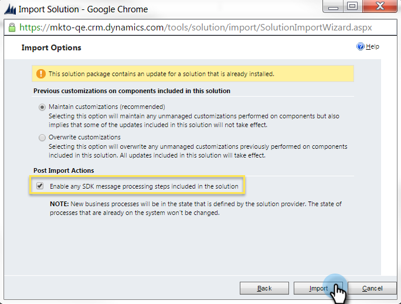

# Stap 1 van 4: Installeer de Marketo-oplossing met de Wachtwoordbeheerverbinding van de Eigenaar van het Middel {#step-1-of-4-install-the-marketo-solution-ropc}

Voordat u [!DNL Microsoft Dynamics] 365 en Marketo kunt synchroniseren, moet u eerst de Marketo-oplossing installeren in [!DNL Dynamics] . **[!DNL Dynamics]Beheerdersmachtigingen zijn vereist.**

>[!CAUTION]
>
>* Schakel aangepaste entiteitssynchronisatie niet in voordat de eerste synchronisatie is voltooid. U wordt via e-mail op de hoogte gesteld zodra de eerste synchronisatie is voltooid.
>* Als u MFA (Multi-Factor Authentication) hebt ingeschakeld voor uw [!DNL Dynamics] -synchronisatie, moet u deze uitschakelen voordat [!DNL Dynamics] correct kan synchroniseren met Marketo. Voor extra informatie, gelieve te contacteren {de Steun van 0} Marketo [.](https://nation.marketo.com/t5/Support/ct-p/Support)

>[!NOTE]
>
>Nadat u Marketo synchroniseert met een CRM, kunt u geen nieuwe synchronisatie uitvoeren zonder de instantie te vervangen.

>[!PREREQUISITES]
>
>[ Download de Oplossing van het Beheer van de Lood van Marketo ](/help/marketo/product-docs/crm-sync/microsoft-dynamics-sync/sync-setup/download-the-marketo-lead-management-solution.md)

1. Login aan **[[!DNL Microsoft Office 365]](https://login.microsoftonline.com/)**.

   

1. Klik op  en selecteer **[!UICONTROL CRM]** .

   

1. Klik op  . Selecteer **[!UICONTROL Settings]** in het vervolgkeuzemenu en selecteer vervolgens **[!UICONTROL Solutions]** .

   

1. Klik op **[!UICONTROL Import]**.

   

1. Klik op **[!UICONTROL Choose File]**. Selecteer de oplossing van het Beheer van de Lood van Marketo u [&#128279;](/help/marketo/product-docs/crm-sync/microsoft-dynamics-sync/sync-setup/download-the-marketo-lead-management-solution.md) downloadde. Klik op **[!UICONTROL Next]**.

   

1. Bekijk de Informatie van de Oplossing en klik **[!UICONTROL View solution package details]**.

   

1. Klik op **[!UICONTROL Close]** als u alle details hebt gecontroleerd.

   

1. Nu, terug op de pagina van de Informatie van de Oplossing, klik **[!UICONTROL Next]**.

   

1. Controleer of het selectievakje SDK is ingeschakeld. Klik op **[!UICONTROL Import]**.

   

   >[!TIP]
   >
   >U moet pop-ups in uw browser inschakelen om het installatieproces te voltooien.

1. Wacht nu tot het importeren is voltooid. Opstaan en wat stretches uitvoeren.

   

1. Klik op **[!UICONTROL Close]**.

   >[!NOTE]
   >
   >Je ziet mogelijk een bericht met de melding &quot;Marketo Lead Management completed with warning&quot; (Beheer van leads is voltooid met een waarschuwing). Dat wordt volledig verwacht.

   

1. &quot;Marketo Lead Management&quot; wordt nu weergegeven in de lijst met oplossingen.

   

1. Selecteer **[!UICONTROL Marketo Lead Management]** en klik op **[!UICONTROL Publish All Customizations]** .

   

   Mooi werk! De installatie is voltooid.

   >[!MORELIKETHIS]
   >
   >[ Stap 2 van 4: Opstelling de Oplossing van Marketo met de Verbinding van de Controle van het Wachtwoord van de Eigenaar van het Middel ](/help/marketo/product-docs/crm-sync/microsoft-dynamics-sync/sync-setup/microsoft-dynamics-365-with-ropc-connection/step-2-of-4-set-up.md){target="_blank"}
