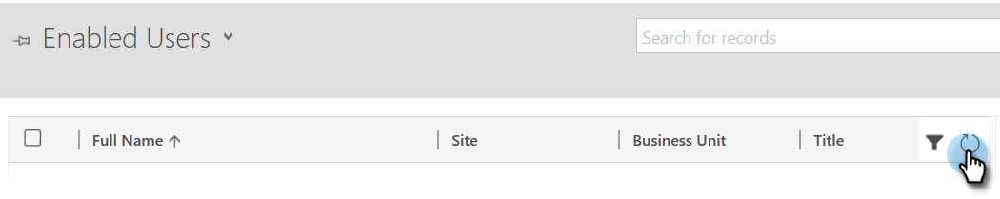
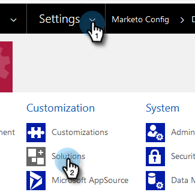

# Stap 2 van 4: Opstelling de Oplossing van Marketo met de Verbinding van het Wachtwoord van de Eigenaar van het Middel {#step-2-of-4-set-up-the-marketo-solution-ropc}

Laten we beginnen met het maken van een gebruikersaccount.

>[!PREREQUISITES]
>
>[Stap 1 van 4: Installeer de Marketo-oplossing met de Wachtwoordbeheerverbinding van de Eigenaar van het Middel](/help/marketo/product-docs/crm-sync/microsoft-dynamics-sync/sync-setup/microsoft-dynamics-365-with-ropc-connection/step-1-of-4-install.md){target="_blank"}

## Nieuwe gebruiker maken {#create-a-new-user}

1. Meld u aan bij Dynamiek. Klik op het pictogram Instellingen en selecteer **[!UICONTROL Advanced Settings]**.

   

1. Klik op **[!UICONTROL Settings]** en selecteer **[!UICONTROL Security]**.

   

1. Klik op **[!UICONTROL Users]**.

   

1. Klik op **[!UICONTROL New]**.

   

1. Klikken **[!UICONTROL Add and License Users]** in het nieuwe venster.

   

1. Er wordt een nieuw tabblad geopend. Klikken **[!UICONTROL Admin]** boven aan de pagina.

   

1. Er wordt een ander nieuw tabblad geopend. Klik op **[!UICONTROL Add a user]**.

   

   >[!IMPORTANT]
   >
   >De gebruiker van de Synchronisatie zou lees toestemming aan Marketo Config moeten hebben.

1. Voer al uw gegevens in. Als u klaar bent, klikt u **[!UICONTROL Add]**.

   

   >[!NOTE]
   >
   >Deze naam moet een specifieke synchronisatiegebruiker zijn en geen bestaande rekening van de gebruiker van CRM. Het hoeft geen echt e-mailadres te zijn.

1. Voer het e-mailbericht in waarin u de nieuwe gebruikersgegevens wilt ontvangen en klik op **[!UICONTROL Send email and close]**.

   

## Gebruikersrol synchroniseren toewijzen {#assign-sync-user-role}

Wijs de Marketo Sync User rol alleen toe aan de Marketo sync-gebruiker. U hoeft het niet aan andere gebruikers toe te wijzen.

>[!NOTE]
>
>Dit geldt voor Marketo versie 4.0.0.14 en hoger. Voor eerdere versies moeten alle gebruikers de gebruikersrol synchroniseren hebben. Ga voor een upgrade van Marketo naar [Upgrade Marketo Solution for Microsoft Dynamics](/help/marketo/product-docs/crm-sync/microsoft-dynamics-sync/sync-setup/update-the-marketo-solution-for-microsoft-dynamics.md){target="_blank"}.

>[!IMPORTANT]
>
>De taalinstelling van de synchronisatiegebruiker [moet worden ingesteld op Engels](https://portal.dynamics365support.com/knowledgebase/article/KA-01201/en-us){target="_blank"}.

1. Ga terug naar de **[!UICONTROL Enabled Users]** en vernieuwt u de gebruikerslijst.

   

1. Houd de muisaanwijzer boven de nieuwe Marketo Sync-gebruiker en schakel een selectievakje in. Klik om het te selecteren.

   

1. Klik op **[!UICONTROL Manage Roles]**.

   

1. Controleren **[!UICONTROL Marketo Sync User]** en klik op **[!UICONTROL OK]**.

   

   >[!NOTE]
   >
   >Alle updates die door de synchronisatiegebruiker in uw CRM worden aangebracht, worden _niet_ worden gesynchroniseerd naar Marketo.

## Marketo-oplossing configureren {#configure-marketo-solution}

Bijna daar! Alles wat we nog hebben, is om Marketo Solution te informeren over de nieuwe gebruiker die is gemaakt.

1. Ga terug naar het gedeelte Geavanceerde instellingen en klik op de knop  pictogram naast Instellingen en selecteer **[!UICONTROL Marketo Config]**.

   

   >[!NOTE]
   >
   >Als u het niet ziet **[!UICONTROL Marketo Config]** vernieuwt de pagina in het menu Instellingen. Als dat niet werkt, probeert u [De Marketo-oplossing publiceren](/help/marketo/product-docs/crm-sync/microsoft-dynamics-sync/sync-setup/microsoft-dynamics-365-with-ropc-connection/step-1-of-4-install.md){target="_blank"} opnieuw of logout and back in.

1. Klik op **[!UICONTROL Default]**.

   

1. Klik op de knop Zoeken op de knop **[!UICONTROL Marketo User]** en selecteer de synchronisatiegebruiker u creeerde.

   

1. Klik op de knop  in de rechterbenedenhoek om de wijzigingen op te slaan.

   

1. Klik op de knop **X** in de rechterbovenhoek om het scherm te sluiten.

   

1. Klik op de knop  pictogram naast Instellingen en selecteer **[!UICONTROL Solutions]**.

   

1. Klik op de knop **[!UICONTROL Publish All Customizations]** knop.

   

>[!MORELIKETHIS]
>
>[Stap 3 van 4: Verbind de Oplossing van Marketo met de Verbinding van het Wachtwoord van de Eigenaar van het Middel](/help/marketo/product-docs/crm-sync/microsoft-dynamics-sync/sync-setup/microsoft-dynamics-365-with-ropc-connection/step-3-of-4-set-up.md){target="_blank"}
