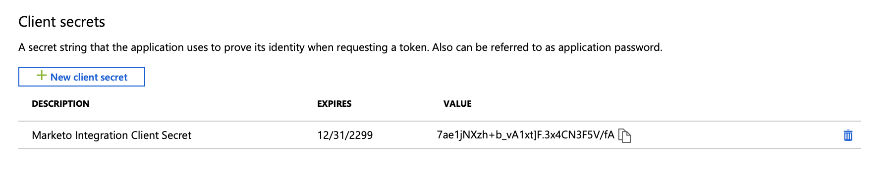

# Stap 3 van 4: Client App instellen op MS [!DNL Dynamics] {#step-3-of-4-set-up-client-app-ms-dynamics-ropc}

>[!PREREQUISITES]
>
>* [ Stap 1 van 4: Installeer de Oplossing van Marketo met de Verbinding van de Controle van het Wachtwoord van de Eigenaar van het Middel ](/help/marketo/product-docs/crm-sync/microsoft-dynamics-sync/sync-setup/microsoft-dynamics-365-with-ropc-connection/step-1-of-4-install.md){target="_blank"}
>* [ Stap 2 van 4: Opstelling de Oplossing van Marketo met de Verbinding van de Controle van het Wachtwoord van de Eigenaar van het Middel ](/help/marketo/product-docs/crm-sync/microsoft-dynamics-sync/sync-setup/microsoft-dynamics-365-with-ropc-connection/step-2-of-4-set-up.md){target="_blank"}

1. Navigeer aan dit [ artikel van Microsoft ](https://docs.microsoft.com/en-us/powerapps/developer/common-data-service/walkthrough-register-app-azure-active-directory#create-an-application-registration){target="_blank"}.

1. Voer alle stappen uit. Voor Stap 3, ga een relevante toepassingsnaam (bijvoorbeeld, &quot;[!DNL Marketo Integration]&quot;) in. Selecteer onder Ondersteunde accounttypen alleen Account in deze directory.

1. Schrijf de toepassings-id (ClientId) op. Je moet het later in Marketo invoeren.

1. De toestemming van Admin van de subsidie door de stappen in [ dit artikel ](/help/marketo/product-docs/crm-sync/microsoft-dynamics-sync/sync-setup/grant-consent-for-client-id-and-app-registration.md){target="_blank"} te volgen.

1. Genereer een clientgeheim in het beheercentrum door op **[!UICONTROL Certificates & secrets]** te klikken.

   

1. Klik op **[!UICONTROL New client secret]**.

   

1. Voeg een beschrijving van Clientgeheim toe en klik op **[!UICONTROL Add]** .

   

   >[!CAUTION]
   >
   >Zorg ervoor om nota van de Geheime waarde van de Cliënt te nemen (die in het schermafbeelding hieronder wordt gezien), aangezien u het later zult nodig hebben. Het wordt slechts één keer getoond, en u zult niet het opnieuw kunnen terugwinnen.

   

## [!DNL Azure AD] Gecombineerd met [!DNL AD FS On-prem] {#azure-ad-federated-with-ad-fs-on-prem}

Federated [!DNL Azure] AD to [!DNL ADFS Onprem] heeft de creatie van een beleid van de Ontdekking van het Huis voor de specifieke toepassing nodig. Met dit beleid, [!DNL Azure] AD zal het authentificatieverzoek aan de dienst van de federatie opnieuw richten. Synchronisatie van wachtwoordhash moet hiervoor in [!DNL AD Connect] zijn ingeschakeld. Voor meer informatie, gelieve te zien [[!DNL OAuth]  met  [!DNL ROPC] ](https://docs.microsoft.com/en-us/azure/active-directory/develop/v2-oauth-ropc) en [ plaats een harde beleid voor een toepassing ](https://docs.microsoft.com/en-us/azure/active-directory/manage-apps/configure-authentication-for-federated-users-portal#example-set-an-hrd-policy-for-an-application).

De extra verwijzingen [ kunnen hier ](https://docs.microsoft.com/en-us/azure/active-directory/reports-monitoring/concept-all-sign-ins#:~:text=Interactive%20user%20sign%2Dins%20are,as%20the%20Microsoft%20Authenticator%20app.&text=This%20report%20also%20include%20federated,are%20federated%20to%20Azure%20AD.){target="_blank"} worden gevonden.

## Voordat u verdergaat met stap 4 {#before-proceeding-to-step-4}

* Als u het aantal verslagen wilt beperken u synchroniseert, [ opstelling een filter van de douanesynchronisatie ](/help/marketo/product-docs/crm-sync/microsoft-dynamics-sync/create-a-custom-dynamics-sync-filter.md) nu.
* Stel [ in werking bevestigt  [!DNL Microsoft Dynamics]  Synchronisatie ](/help/marketo/product-docs/crm-sync/microsoft-dynamics-sync/sync-setup/validate-microsoft-dynamics-sync.md) proces. Hierbij wordt gecontroleerd of de eerste instellingen correct zijn uitgevoerd.
* Meld u aan bij Marketo Sync User in [!DNL Microsoft Dynamics] CRM.

>[!MORELIKETHIS]
>
>* [ Stap 4 van 4: Verbind de Oplossing van Marketo met de Verbinding van de Controle van het Wachtwoord van de Eigenaar van het Middel ](/help/marketo/product-docs/crm-sync/microsoft-dynamics-sync/sync-setup/microsoft-dynamics-365-with-ropc-connection/step-4-of-4-connect.md){target="_blank"}
