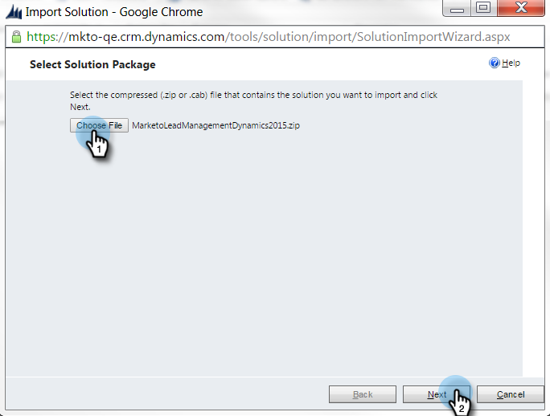
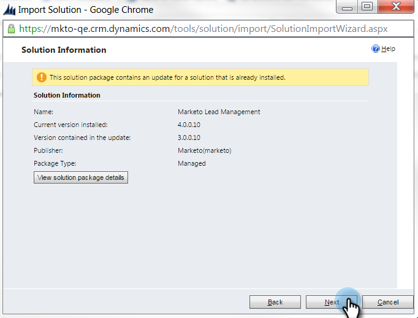

# Stap 1 van 3: Installeer de Marketo-oplossing met Server naar Server-verbinding {#step-1-of-3-install-the-marketo-solution-s2s}

Voordat u [!DNL Microsoft Dynamics 365] en Marketo kunt synchroniseren, moet u eerst de Marketo-oplossing installeren in [!DNL Dynamics] . **[!DNL Dynamics]Beheerdersmachtigingen zijn vereist.**

>[!CAUTION]
>
>Schakel aangepaste entiteitssynchronisatie niet in voordat de eerste synchronisatie is voltooid. U wordt via e-mail op de hoogte gesteld zodra de eerste synchronisatie is voltooid.

>[!NOTE]
>
>Nadat u Marketo synchroniseert met een CRM, kunt u geen nieuwe synchronisatie uitvoeren zonder de instantie te vervangen.

>[!PREREQUISITES]
>
>[&#x200B; Download de Oplossing van het Beheer van de Lood van Marketo &#x200B;](/help/marketo/product-docs/crm-sync/microsoft-dynamics-sync/sync-setup/download-the-marketo-lead-management-solution.md){target="_blank"}

1. Login aan **[[!DNL Microsoft Office 365]](https://login.microsoftonline.com/)**.

   

1. Klik op  en selecteer **[!UICONTROL CRM]** .

   

1. Klik op  . Selecteer **[!UICONTROL Settings]** in het vervolgkeuzemenu en selecteer vervolgens **[!UICONTROL Solutions]** .

   

1. Klik op **[!UICONTROL Import]**.

   

1. Klik op **[!UICONTROL Choose File]**. Selecteer de oplossing van het Beheer van de Lood van Marketo u [&#128279;](/help/marketo/product-docs/crm-sync/microsoft-dynamics-sync/sync-setup/download-the-marketo-lead-management-solution.md) downloadde. Klik op **[!UICONTROL Next]**.

   

1. Bekijk de Informatie van de Oplossing en klik **[!UICONTROL View solution package details]**.

   

1. Klik op **[!UICONTROL Close]** als u alle details hebt gecontroleerd.

   

1. Klik nu weer op de pagina [!UICONTROL Solution Information] op **[!UICONTROL Next]** .

   

1. Controleer of het selectievakje SDK is ingeschakeld. Klik op **[!UICONTROL Import]**.

   

   >[!TIP]
   >
   >U moet pop-ups in uw browser inschakelen om het installatieproces te voltooien.

1. Wacht nu tot het importeren is voltooid.

   

1. Klik op **[!UICONTROL Close]**.

   >[!NOTE]
   >
   >Je ziet mogelijk een bericht met de melding &quot;Marketo Lead Management completed with warning&quot; (Beheer van leads is voltooid met een waarschuwing). Dat wordt volledig verwacht.

   

1. [!UICONTROL Marketo Lead Management] wordt nu weergegeven in de lijst met oplossingen.

   

1. Selecteer **[!UICONTROL Marketo Lead Management]** en klik op **[!UICONTROL Publish All Customizations]** .

   

   Hoogste vijf! De installatie is voltooid.

   >[!MORELIKETHIS]
   >
   >[&#x200B; Stap 2 van 3: Opstelling de Oplossing van Marketo met Verbinding S2S &#x200B;](/help/marketo/product-docs/crm-sync/microsoft-dynamics-sync/sync-setup/microsoft-dynamics-365-with-s2s-connection/step-2-of-3-set-up.md){target="_blank"}
